# 容错与恢复

## 🎯 核心知识点

- 容错设计原则
- 故障检测机制
- 自动恢复策略
- 容灾备份方案
- 混沌工程实践

## 📊 容错架构设计

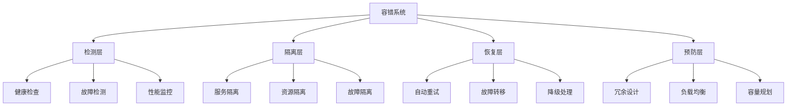

## 💡 面试题目

### **初级** 服务容错机制设计
**题目：** 设计一个电商系统的服务容错机制，确保在依赖服务出现故障时系统仍能正常工作。

**答案要点：**

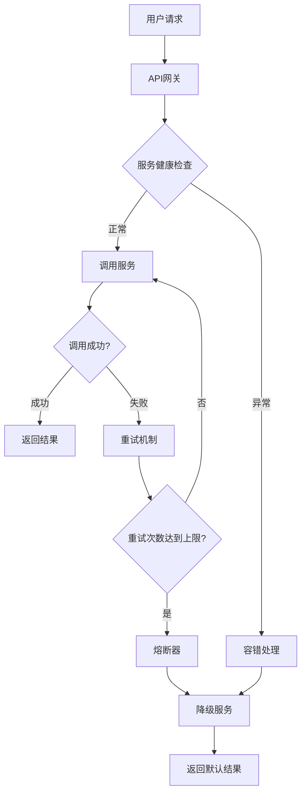

**容错模式对比：**

| 模式 | 适用场景 | 实现复杂度 | 恢复能力 | 性能影响 |
|------|----------|------------|----------|----------|
| 重试 | 临时故障 | 低 | 高 | 低 |
| 熔断器 | 持续故障 | 中等 | 中等 | 中等 |
| 降级 | 服务不可用 | 中等 | 中等 | 低 |
| 超时 | 响应慢 | 低 | 低 | 低 |
| 隔离 | 资源竞争 | 高 | 高 | 中等 |

### **中级** 分布式系统故障检测
**题目：** 设计一个分布式系统的故障检测机制，能够快速发现节点故障并触发恢复流程。

**答案要点：**

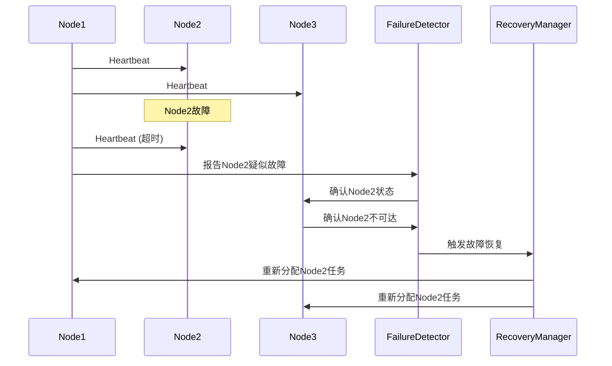

**故障检测算法：**

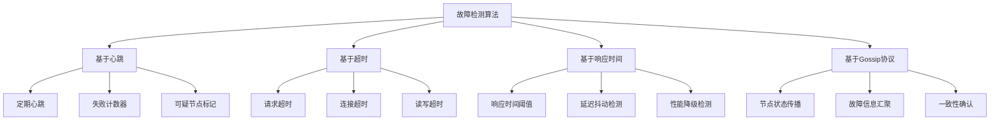

### **高级** 多数据中心容灾设计
**题目：** 设计一个支持多数据中心的容灾系统，要求RPO<1分钟，RTO<5分钟。

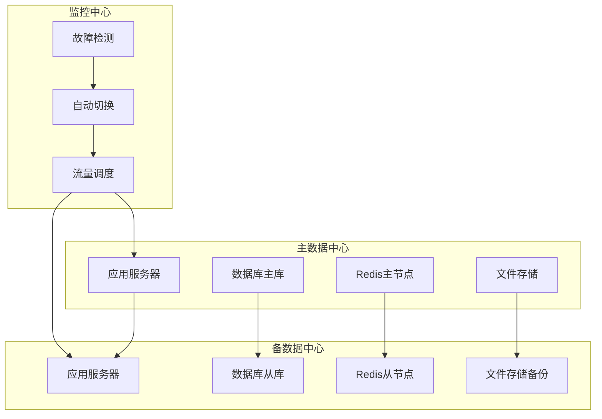

## 🛡️ 容错设计模式

### 熔断器模式

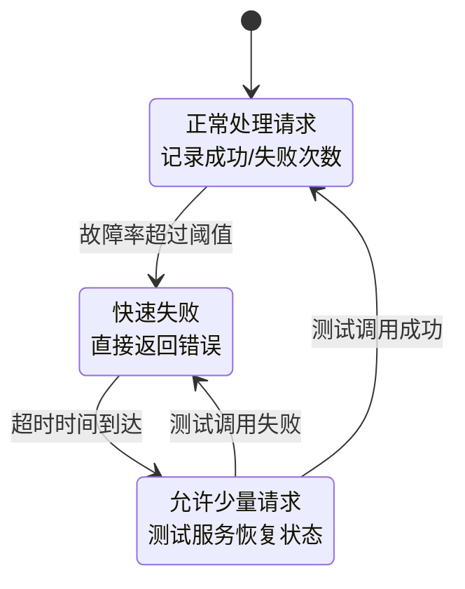

**熔断器参数配置：**

| 参数 | 说明 | 典型值 | 调优建议 |
|------|------|--------|----------|
| 失败阈值 | 触发熔断的失败率 | 50% | 根据业务容忍度调整 |
| 时间窗口 | 统计时间窗口 | 10秒 | 考虑请求频率 |
| 最小请求数 | 最小统计样本 | 20 | 避免小样本误判 |
| 等待时间 | 熔断器打开时长 | 60秒 | 给服务恢复时间 |
| 半开试探数 | 半开状态测试请求数 | 3 | 快速验证恢复状态 |

### 舱壁模式

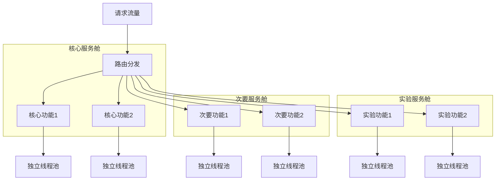

### 重试模式

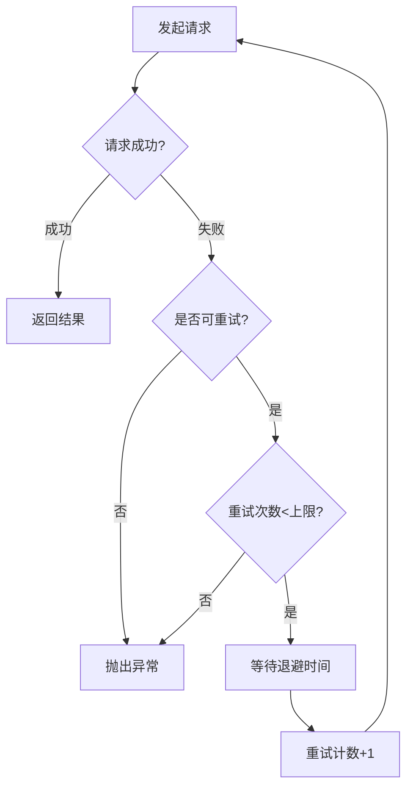

**重试策略对比：**

| 策略 | 描述 | 适用场景 | 优缺点 |
|------|------|----------|--------|
| 立即重试 | 失败后立即重试 | 网络抖动 | 简单，但可能加重系统负担 |
| 固定延迟 | 固定时间间隔重试 | 临时资源不足 | 避免系统压力，但恢复慢 |
| 指数退避 | 延迟时间指数增长 | 系统过载 | 自适应，但复杂度高 |
| 随机抖动 | 添加随机延迟 | 高并发场景 | 避免雷群效应 |

## 🔧 故障恢复策略

### 自动故障转移

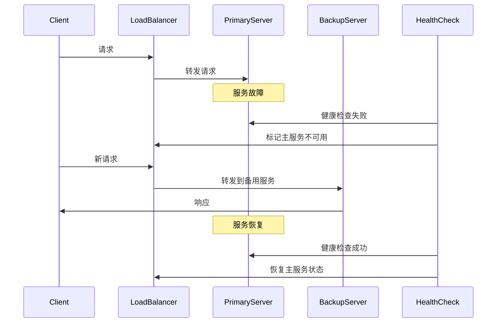

### 数据恢复机制

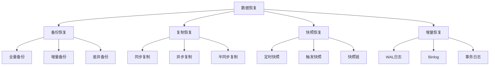

### 服务降级策略

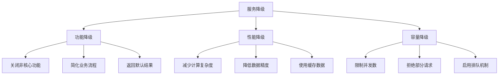

## 📊 容灾指标定义

### RTO与RPO

```mermaid
timeline
    title 故障恢复时间线
    
    section 正常运行
        : 系统正常服务
    
    section 故障发生
        : 故障发生点
        : 最后有效数据备份
    
    section 恢复过程
        : 故障检测
        : 启动恢复流程
        : 数据恢复完成
        : 服务恢复完成
    
    section 指标定义
        : RPO (恢复点目标)
        : RTO (恢复时间目标)
```

**容灾等级划分：**

| 等级 | RTO | RPO | 可用性 | 成本 | 适用场景 |
|------|-----|-----|--------|------|----------|
| Tier 0 | >24小时 | >4小时 | 95% | 低 | 非关键系统 |
| Tier 1 | 4-24小时 | 1-4小时 | 99% | 中低 | 一般业务系统 |
| Tier 2 | 1-4小时 | 15分钟-1小时 | 99.9% | 中等 | 重要业务系统 |
| Tier 3 | 15分钟-1小时 | 1-15分钟 | 99.95% | 中高 | 核心业务系统 |
| Tier 4 | <15分钟 | <1分钟 | 99.99% | 高 | 关键业务系统 |

### 容错能力评估

```mermaid
radar
    title 系统容错能力评估
    "故障检测" : 8
    "自动恢复" : 7
    "数据一致性" : 9
    "服务可用性" : 8
    "性能影响" : 6
    "运维复杂度" : 5
```

## 🏗️ 技术实现

### 健康检查实现

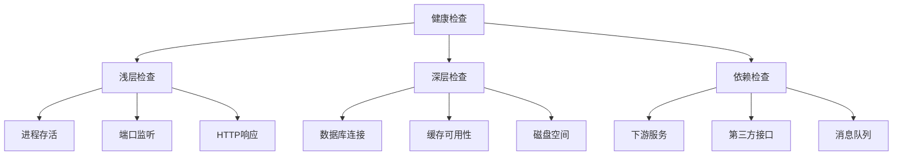

### 分布式锁与选主

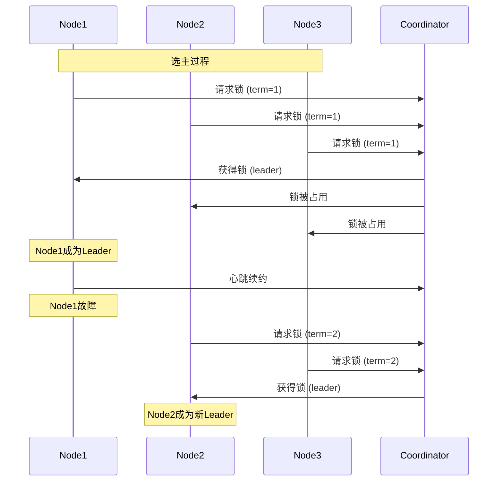

## 🧪 混沌工程

### 故障注入实验

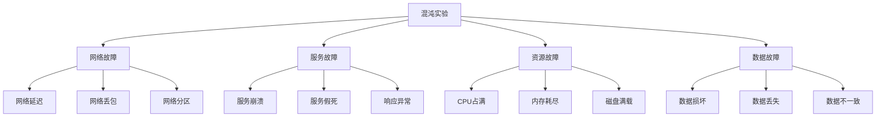

### 混沌实验执行流程

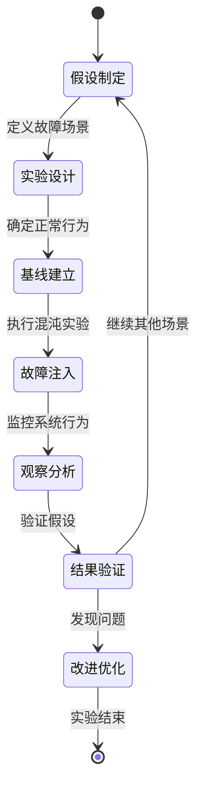

## 💡 面试要点总结

### 容错设计原则
1. **预防优于治疗**：设计阶段考虑容错
2. **快速失败**：尽早发现并处理故障
3. **优雅降级**：保证核心功能可用
4. **隔离故障**：避免故障传播扩散

### 常见容错模式
- **重试模式**：处理临时性故障
- **熔断器模式**：防止故障扩散
- **舱壁模式**：隔离不同功能模块
- **超时模式**：避免资源长时间占用

### 恢复策略选择
- **主动恢复**：系统自动检测和恢复
- **被动恢复**：依赖外部干预恢复
- **预防性维护**：定期检查和更新
- **应急预案**：制定详细的故障处理流程

### 监控指标体系
- **业务指标**：订单成功率、用户活跃度
- **技术指标**：响应时间、错误率、吞吐量
- **基础指标**：CPU、内存、网络、存储
- **自定义指标**：业务特有的关键指标

### 常见误区
❌ **过度设计**：为不常见故障设计复杂方案
❌ **忽视人为因素**：只考虑技术故障，忽略操作失误
❌ **缺乏演练**：容灾方案缺乏实际验证
❌ **单点依赖**：在容错系统中引入新的单点故障

## 🔗 相关链接

- [← 返回系统设计主页](./README.md)
- [分布式系统](./distributed-systems.md)
- [负载均衡](./load-balancing.md)
- [监控与可观测性](./monitoring-observability.md)

---

*容错是分布式系统的基本要求，需要在设计、开发、测试各个阶段都要考虑* ⚡ 