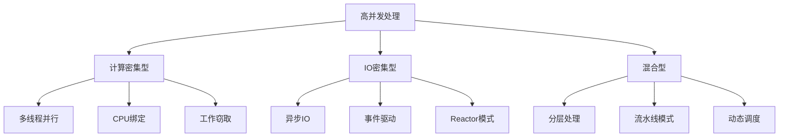
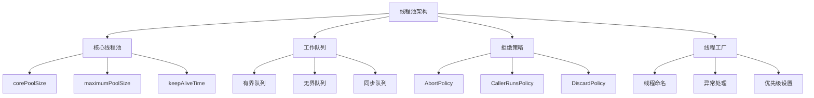
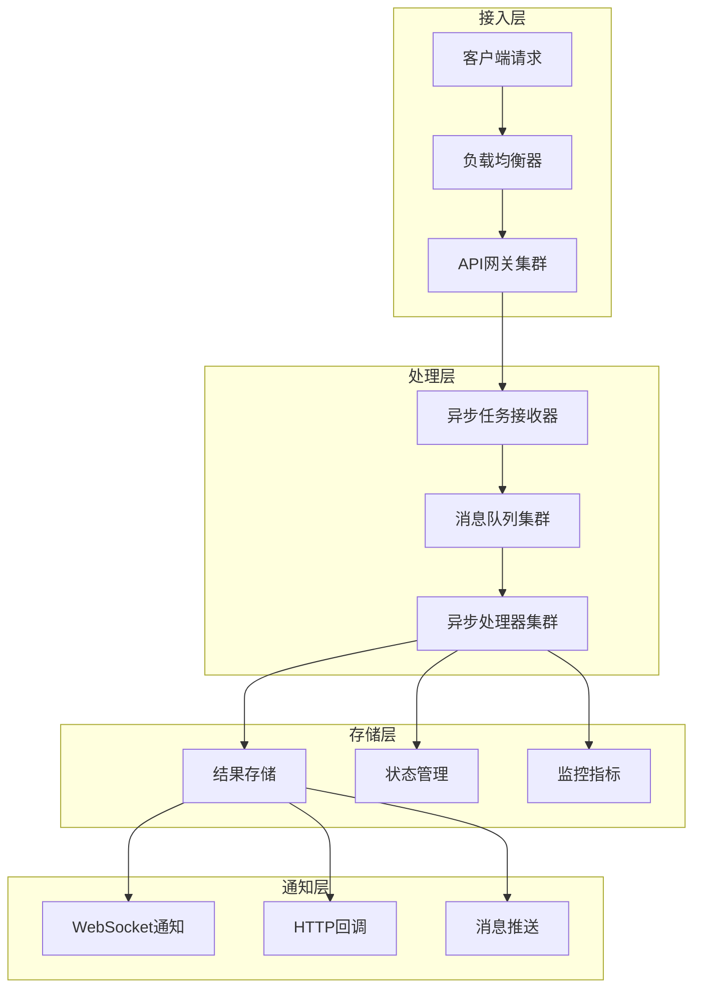
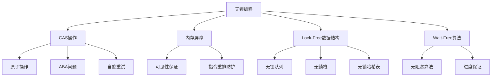
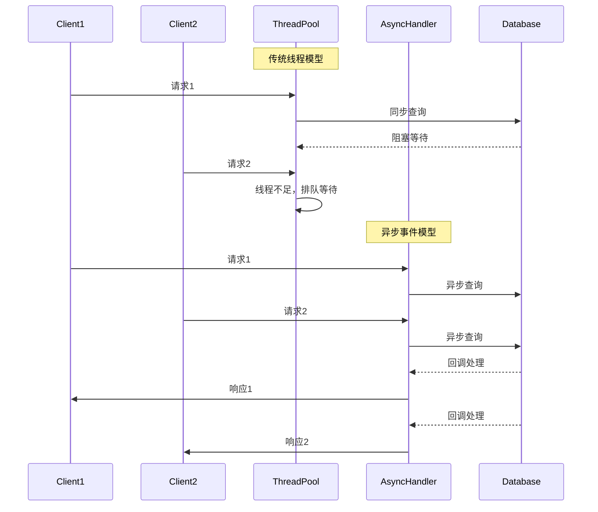
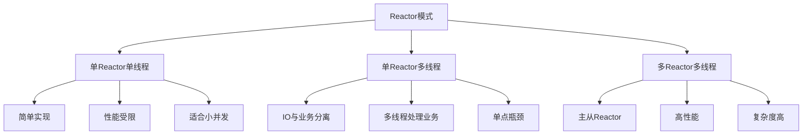
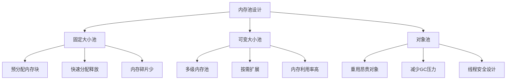
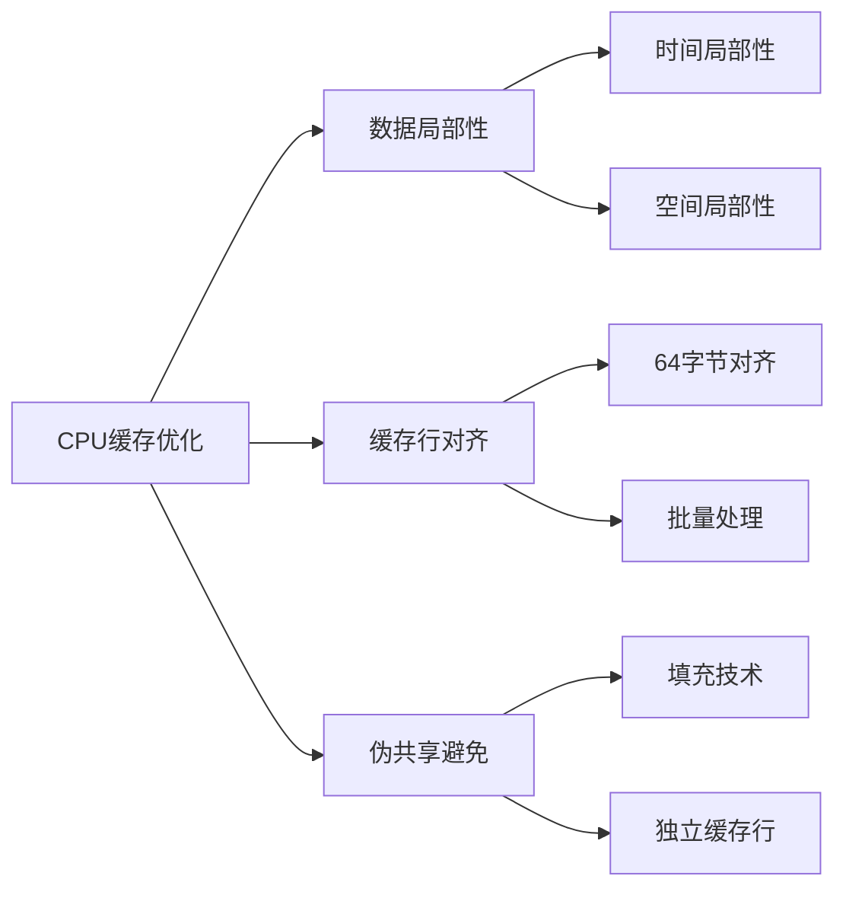
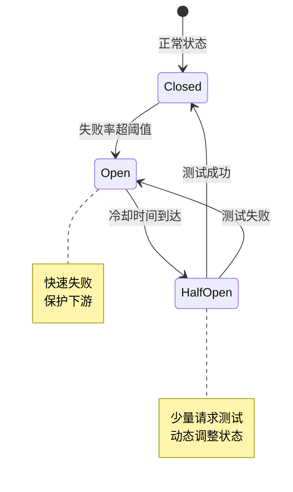
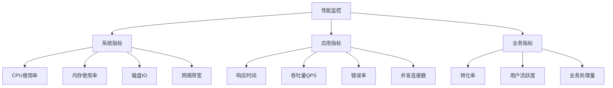

# 高并发处理

## 🎯 核心知识点

- 并发编程模型
- 线程池设计优化
- 异步处理架构
- 无锁编程技术
- 性能调优策略

## 📊 高并发架构模式

## 💡 面试题目

### **初级** 线程池设计原理
**题目：** 设计一个线程池，说明核心参数的作用和调优策略。

**答案要点：**

**线程池参数对比：**

| 参数 | 作用 | 调优建议 |
|------|------|----------|
| corePoolSize | 核心线程数 | CPU密集型：CPU核心数+1 |
| maximumPoolSize | 最大线程数 | IO密集型：2*CPU核心数 |
| keepAliveTime | 线程存活时间 | 根据任务频率调整 |
| workQueue | 工作队列 | 有界队列避免OOM |
| rejectedExecutionHandler | 拒绝策略 | 根据业务需求选择 |

### **中级** 异步处理架构
**题目：** 设计一个支持百万级并发的异步消息处理系统。

**答案要点：**

### **高级** 无锁编程优化
**题目：** 如何使用无锁数据结构优化高并发场景的性能？

## ⚡ 并发模型对比

### 传统线程模型 vs 异步模型

### 性能特征对比

| 模型 | 内存占用 | CPU利用率 | 并发能力 | 编程复杂度 |
|------|----------|-----------|----------|------------|
| 传统线程 | 高(每线程1-2MB) | 中等 | 受限于线程数 | 低 |
| 异步事件 | 低 | 高 | 高 | 中等 |
| 协程 | 低(每协程KB级) | 高 | 很高 | 中等 |
| Actor模型 | 中等 | 高 | 高 | 高 |

## 🔧 技术实现

### Reactor模式实现

### 内存池设计

## 📈 性能优化策略

### CPU缓存优化

### JVM调优要点

| 调优项 | 参数 | 建议值 | 说明 |
|--------|------|--------|------|
| 堆内存 | -Xms/-Xmx | 相同值 | 避免动态扩容 |
| 新生代 | -Xmn | 堆内存1/4 | 根据对象生命周期 |
| GC算法 | -XX:+UseG1GC | G1GC | 低延迟要求 |
| GC线程 | -XX:ParallelGCThreads | CPU核心数 | 并行回收 |
| 直接内存 | -XX:MaxDirectMemorySize | 根据需求 | NIO场景 |

## 🛡️ 稳定性保障

### 限流熔断机制

### 监控指标体系

## 💡 面试要点总结

### 设计考虑要素
1. **并发模型选择**：线程模型 vs 事件模型 vs 协程模型
2. **资源管理**：线程池、连接池、内存池设计
3. **性能优化**：CPU缓存优化、JVM调优、算法优化
4. **稳定性保障**：限流、熔断、降级、监控

### 技术选型权衡
- **吞吐量 vs 延迟**：批处理提高吞吐量，实时处理降低延迟
- **内存 vs CPU**：内存换CPU，预计算和缓存策略
- **复杂度 vs 性能**：简单方案 vs 高性能方案
- **一致性 vs 可用性**：强一致性影响性能

### 常见问题解决
1. **内存泄漏**：对象池管理、弱引用使用
2. **死锁问题**：锁顺序、超时机制
3. **CPU100%**：无限循环、频繁GC
4. **响应超时**：连接池耗尽、慢查询

## 🔗 相关链接

- [← 返回系统设计主页](./README.md)
- [系统性能优化](./system-performance.md)
- [负载均衡](./load-balancing.md)
- [缓存系统](./caching-systems.md)

---

*高并发处理是现代互联网系统的核心能力，需要从架构、算法、调优多个维度综合考虑* ⚡ 