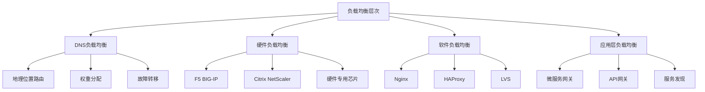
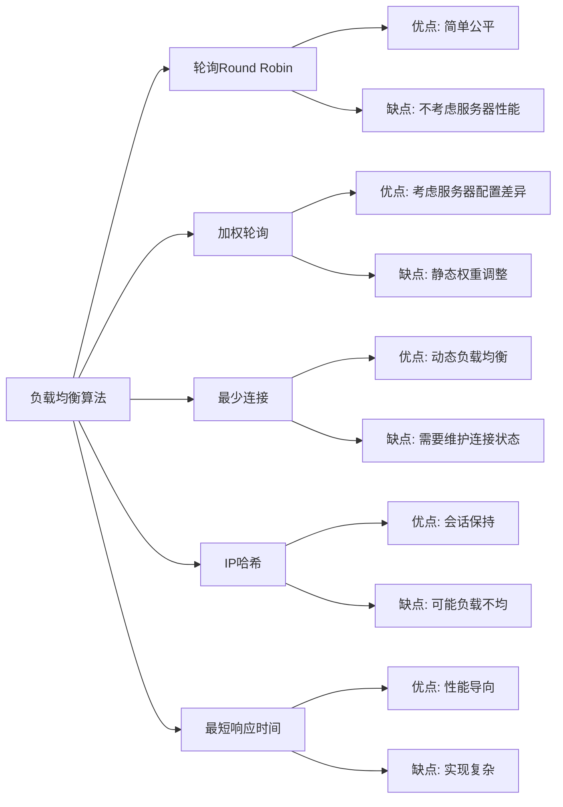
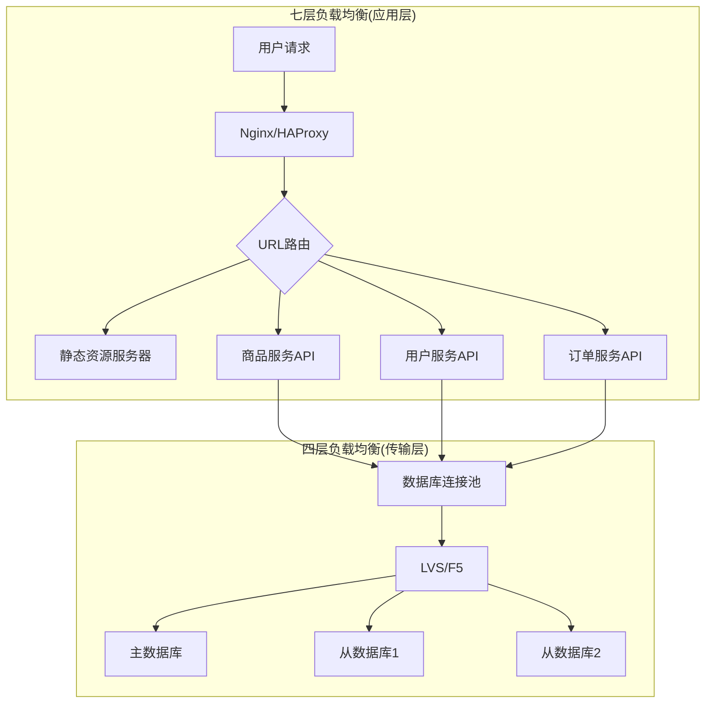
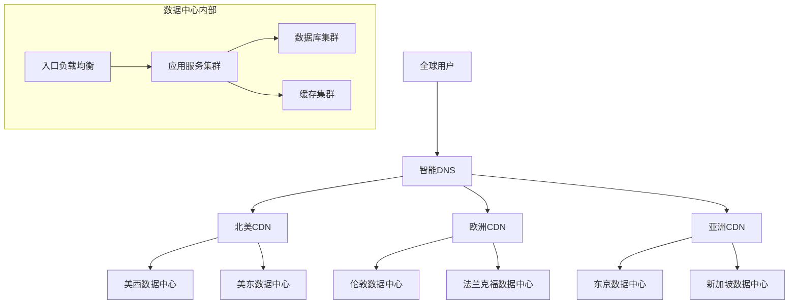
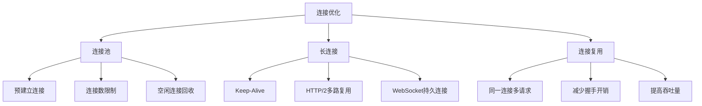
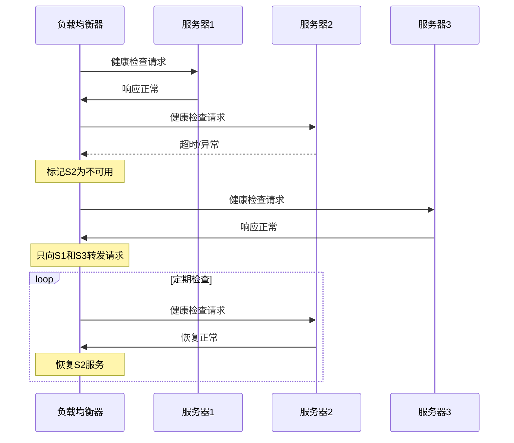
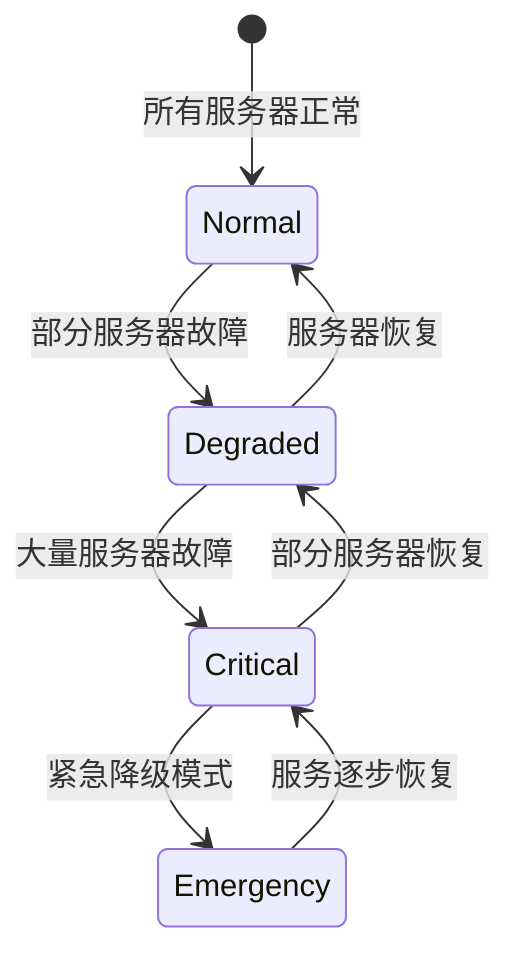
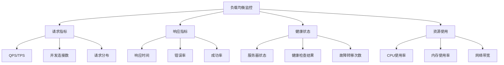
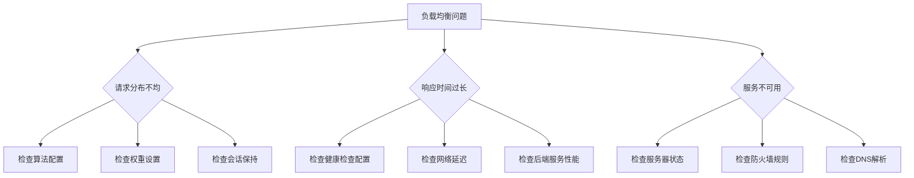

# 负载均衡

## 🎯 核心知识点

- 负载均衡算法
- 硬件负载均衡 vs 软件负载均衡
- 四层负载均衡 vs 七层负载均衡
- 健康检查机制
- 会话保持策略

## 📊 负载均衡架构层次



## 💡 面试题目

### **初级** 负载均衡算法对比
**题目：** 介绍常见的负载均衡算法，并分析各自的优缺点和适用场景。

**答案要点：**



**适用场景分析：**
- **轮询**：无状态服务、服务器配置相同
- **加权轮询**：服务器配置不同、需要差异化分配
- **最少连接**：长连接场景、连接持续时间不确定
- **IP哈希**：需要会话保持、状态化应用
- **最短响应时间**：对延迟敏感的应用

### **中级** 四层 vs 七层负载均衡
**题目：** 设计一个电商系统的负载均衡架构，说明何时使用四层负载均衡，何时使用七层负载均衡？

**答案要点：**



**使用场景对比：**

| 维度 | 四层负载均衡 | 七层负载均衡 |
|------|-------------|-------------|
| 工作层次 | 传输层(TCP/UDP) | 应用层(HTTP/HTTPS) |
| 路由依据 | IP + 端口 | URL、Header、Cookie |
| 性能 | 高性能，低延迟 | 相对较慢，功能丰富 |
| 会话保持 | IP哈希 | Cookie、Session |
| SSL卸载 | 不支持 | 支持 |
| 内容缓存 | 不支持 | 支持 |

### **高级** 全局负载均衡设计
**题目：** 设计一个支持多地域部署的全球化应用的负载均衡方案，考虑延迟、容灾和成本优化。

**答案要点：**



**设计要点：**
1. **DNS智能解析**：基于地理位置和网络状况路由
2. **CDN分发**：静态资源就近缓存
3. **数据中心选择**：延迟、成本、合规性考虑
4. **故障转移**：自动检测和流量切换
5. **数据同步**：跨地域数据一致性保证

## 🔧 负载均衡器配置示例

### Nginx配置示例
```nginx
upstream backend {
    # 加权轮询
    server 192.168.1.10:8080 weight=3;
    server 192.168.1.11:8080 weight=2;
    server 192.168.1.12:8080 weight=1;
    
    # 健康检查
    server 192.168.1.13:8080 backup;
    
    # 会话保持
    ip_hash;
}

server {
    listen 80;
    location / {
        proxy_pass http://backend;
        
        # 健康检查配置
        proxy_connect_timeout 3s;
        proxy_send_timeout 10s;
        proxy_read_timeout 10s;
        
        # 重试机制
        proxy_next_upstream error timeout;
        proxy_next_upstream_tries 3;
    }
}
```

### HAProxy配置示例
```haproxy
backend webservers
    balance roundrobin
    option httpchk GET /health
    
    server web1 192.168.1.10:8080 check weight 3
    server web2 192.168.1.11:8080 check weight 2
    server web3 192.168.1.12:8080 check weight 1 backup
    
    # 会话保持
    cookie SERVERID insert indirect nocache
```

## ⚡ 性能优化策略

### 连接优化



### 缓存策略

| 缓存类型 | 位置 | 缓存内容 | 优势 |
|---------|------|----------|------|
| 浏览器缓存 | 客户端 | 静态资源 | 减少网络传输 |
| CDN缓存 | 边缘节点 | 静态内容 | 就近访问 |
| 负载均衡器缓存 | LB层 | 热点数据 | 减少后端压力 |
| 应用缓存 | 应用服务器 | 计算结果 | 提高响应速度 |

## 🛡️ 高可用保障

### 健康检查机制



### 故障转移策略


## 📈 监控指标

### 关键性能指标


## 🔍 故障排查

### 常见问题诊断


## 💡 面试要点总结

### 设计考虑因素
1. **业务需求**：流量模式、会话要求、地域分布
2. **技术约束**：现有架构、性能要求、成本预算
3. **可用性要求**：SLA目标、故障恢复时间
4. **扩展性规划**：未来流量增长、功能扩展

### 权衡取舍
- **性能 vs 功能**：四层负载均衡 vs 七层负载均衡
- **成本 vs 可靠性**：硬件设备 vs 软件方案
- **简单性 vs 灵活性**：静态配置 vs 动态调整
- **一致性 vs 可用性**：会话保持 vs 负载分布

## 🔗 相关链接

- [← 返回系统设计主页](./README.md)
- [系统设计基础](./system-design-fundamentals.md)
- [高可用架构](./high-availability.md)
- [性能优化](./performance-optimization.md)

---

*负载均衡是系统扩展性和可用性的基础保障* ⚖️ 