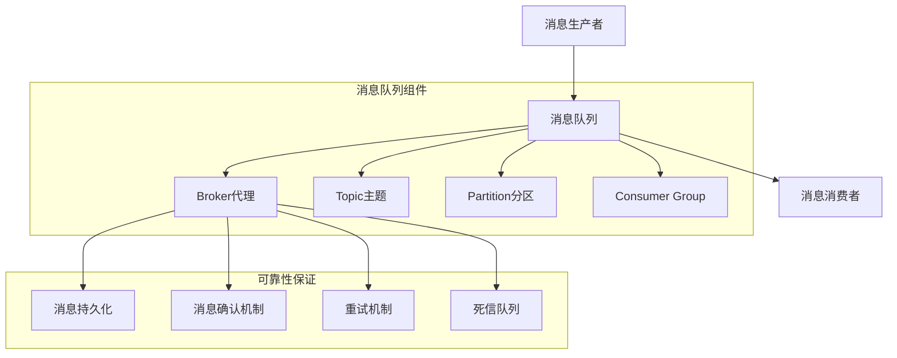
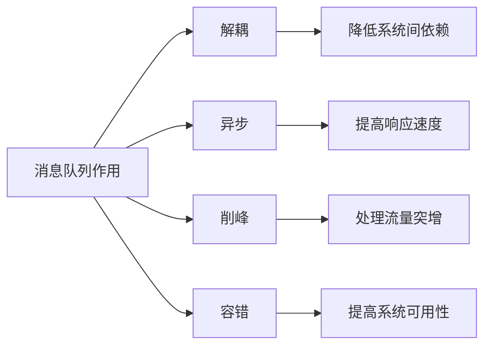
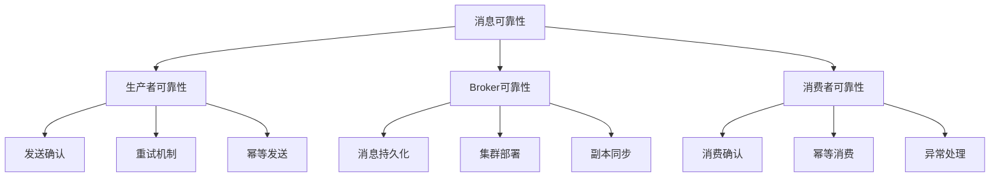
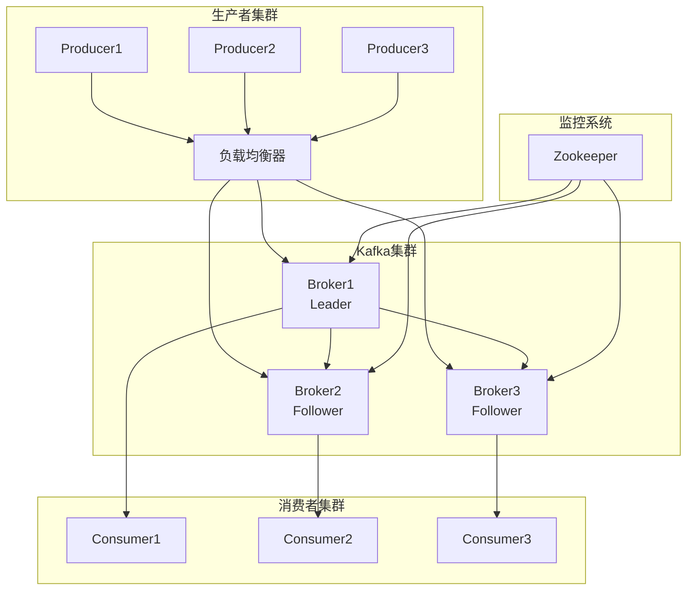
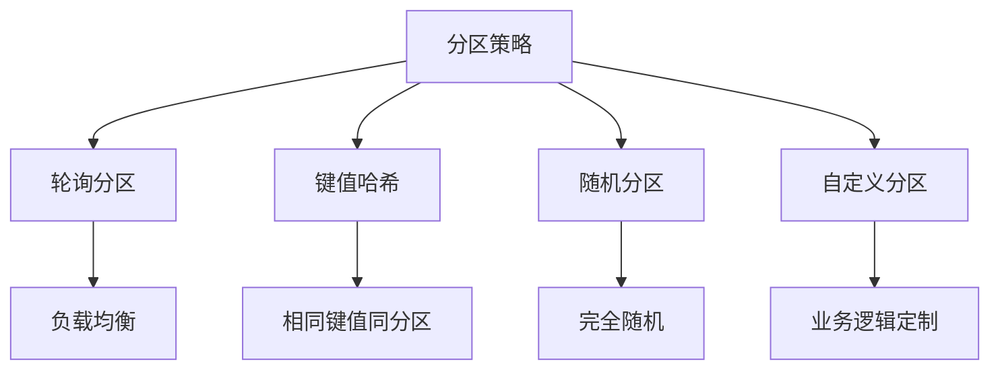
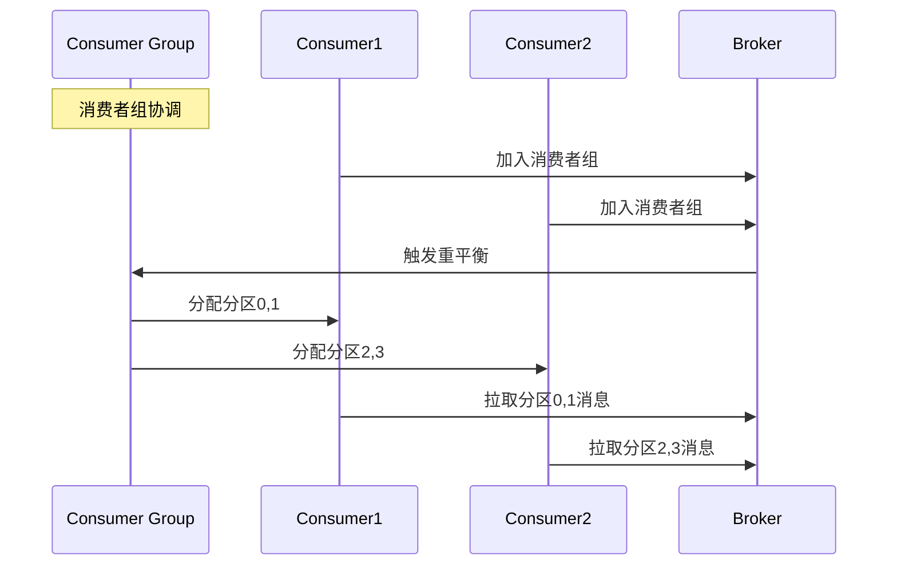

# 消息队列

## 🎯 核心知识点

- 消息队列基本概念
- MQ产品对比分析
- 消息可靠性保证
- 消息顺序性处理
- 高可用架构设计

## 📊 消息队列核心架构

## 💡 面试题目

### **初级** 消息队列基本原理
**题目：** 解释消息队列的作用和核心概念，对比同步调用和异步消息的区别。

**答案要点：**

**同步 vs 异步对比：**

| 特性 | 同步调用 | 异步消息 |
|------|----------|----------|
| 响应时间 | 需等待处理完成 | 立即返回 |
| 耦合度 | 强耦合 | 松耦合 |
| 可靠性 | 调用失败立即感知 | 需要额外机制保证 |
| 扩展性 | 受限于最慢服务 | 独立扩展 |
| 复杂度 | 相对简单 | 需要考虑消息丢失等问题 |

### **中级** 消息可靠性设计
**题目：** 如何保证消息的可靠性传递？包括消息不丢失、不重复、有序处理。

**答案要点：**

**消息投递语义：**
- **At Most Once**: 最多一次，可能丢失
- **At Least Once**: 至少一次，可能重复
- **Exactly Once**: 精确一次，理想状态

### **高级** 高可用消息队列架构
**题目：** 设计一个支持千万级QPS的消息队列系统，需要考虑分区、副本、负载均衡等。

## ⚡ 主流MQ产品对比

| 特性 | RabbitMQ | Kafka | RocketMQ | Pulsar |
|------|----------|-------|----------|--------|
| 性能 | 中等 | 高 | 高 | 高 |
| 可靠性 | 高 | 高 | 高 | 高 |
| 生态 | 成熟 | 丰富 | 阿里系 | 新兴 |
| 学习成本 | 低 | 中 | 中 | 高 |
| 适用场景 | 传统企业 | 大数据 | 电商交易 | 云原生 |

## 🔧 关键技术实现

### 消息分区策略

### 消费者负载均衡

## 🔗 相关链接

- [← 返回系统设计主页](./README.md)
- [分布式系统](./distributed-systems.md)
- [微服务架构](./microservices-architecture.md)

---

*消息队列是构建可扩展分布式系统的关键组件* 📨 