# 微服务架构

## 🎯 核心知识点

- 微服务架构原理
- 服务拆分策略
- API网关设计
- 服务间通信
- 数据管理模式
- 服务治理体系

## 📊 微服务架构演进

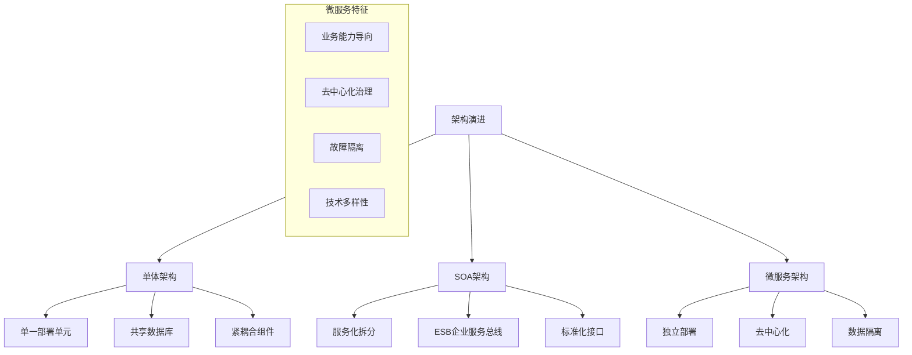

## 💡 面试题目

### **初级** 微服务 vs 单体架构对比
**题目：** 比较微服务架构和单体架构的优缺点，什么情况下应该选择微服务架构？

**答案要点：**

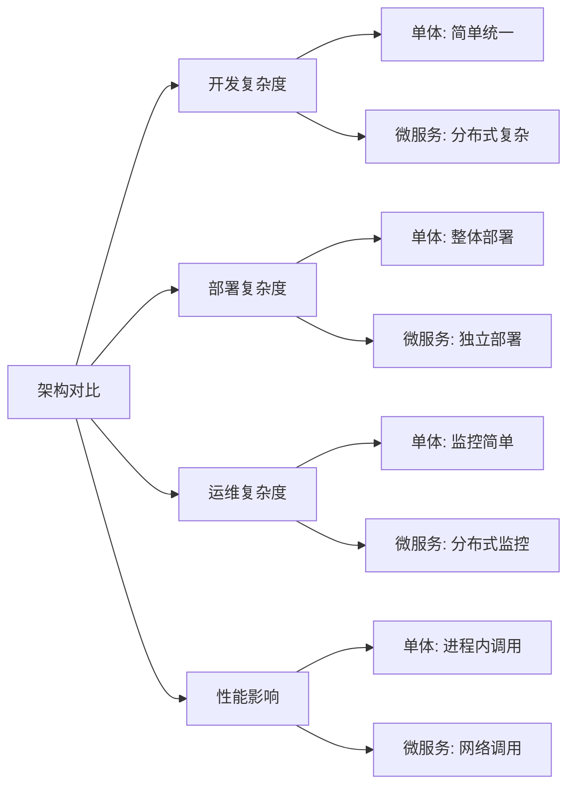

**选择标准矩阵：**

| 因素 | 单体架构 | 微服务架构 |
|------|----------|------------|
| 团队规模 | 小团队(≤10人) | 大团队(>10人) |
| 业务复杂度 | 简单明确 | 复杂多变 |
| 技术栈 | 统一技术栈 | 多元化需求 |
| 部署频率 | 低频部署 | 高频部署 |
| 扩展需求 | 整体扩展 | 差异化扩展 |
| 团队经验 | 传统开发经验 | 分布式经验丰富 |

**微服务适用场景：**
- 大型复杂业务系统
- 高频发布需求
- 团队规模较大且分布式
- 不同服务性能要求差异大
- 需要技术栈多样性

### **中级** 服务拆分策略设计
**题目：** 针对一个电商系统，如何进行微服务拆分？请设计具体的拆分方案和边界定义。

**答案要点：**

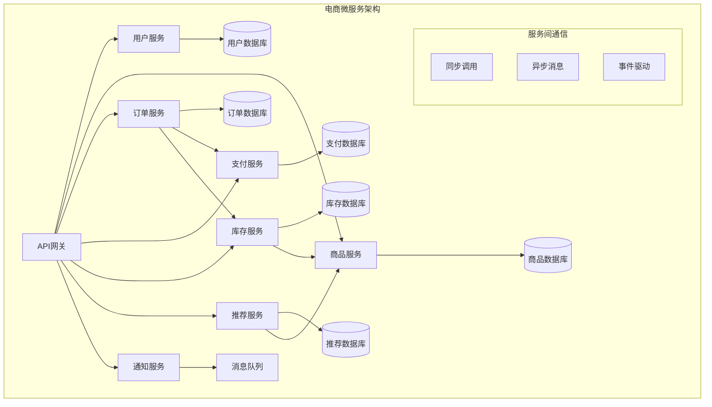

**拆分原则和方法：**

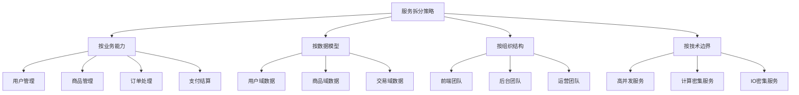

### **高级** 微服务架构治理体系
**题目：** 设计一个完整的微服务治理体系，包括服务发现、配置管理、监控告警、熔断降级等。

**答案要点：**

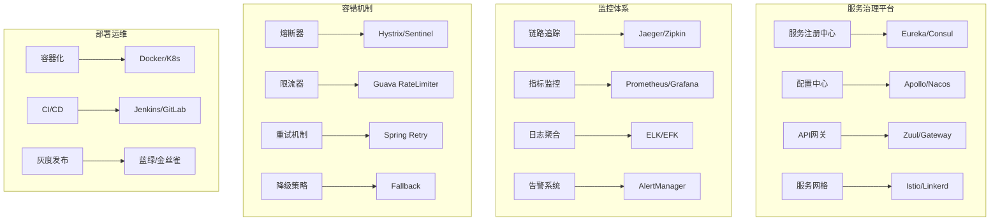

## 🔧 核心组件设计

### API网关架构

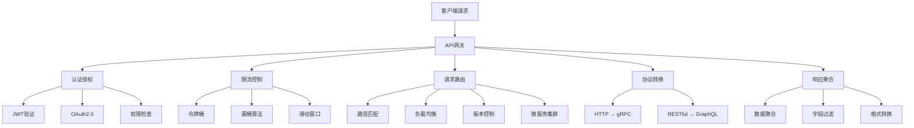

### 服务间通信模式

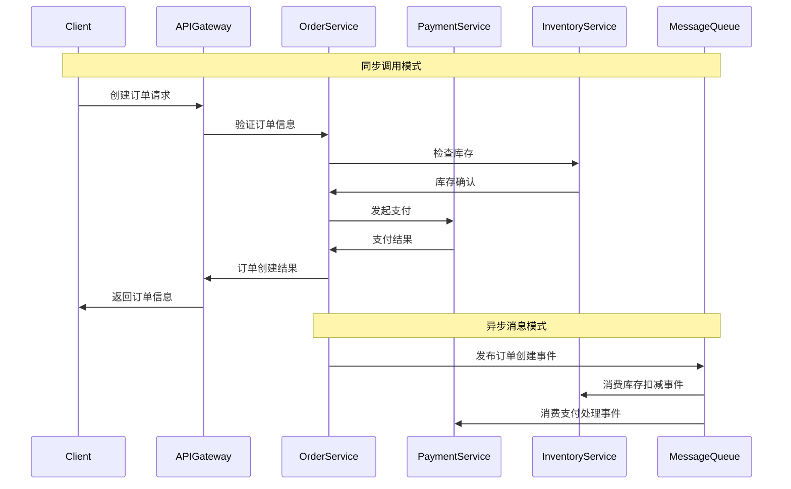

## ⚡ 数据管理策略

### 数据一致性模式

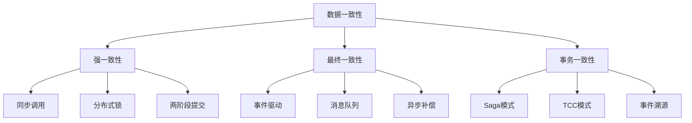

### Saga分布式事务

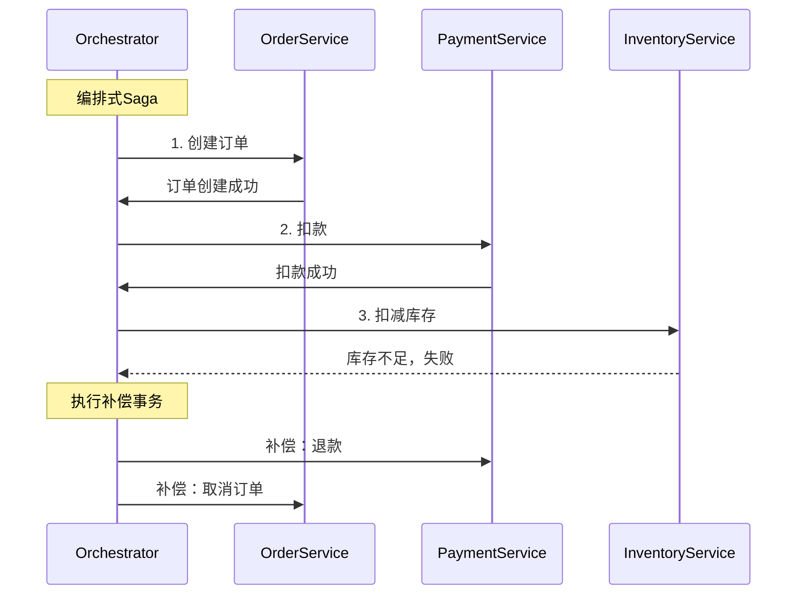

## 🛡️ 容错与监控

### 熔断器模式

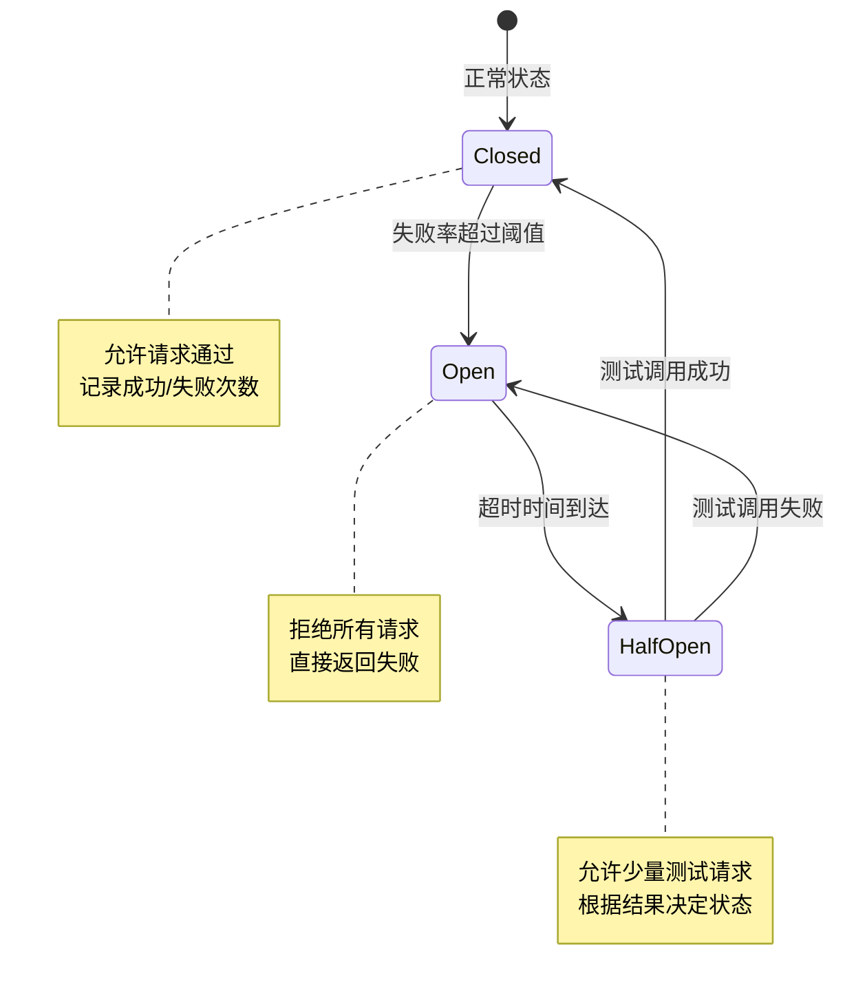

### 服务监控体系

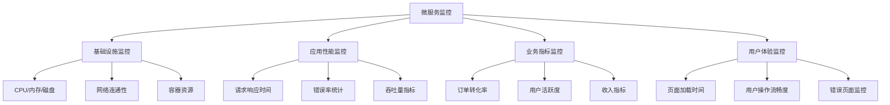

## 📈 部署与扩展

### 容器化部署

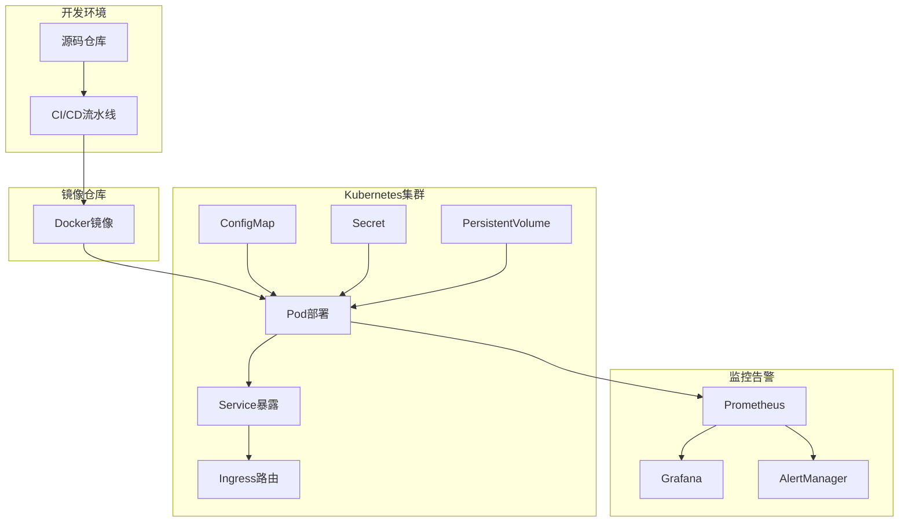

### 弹性扩缩容策略

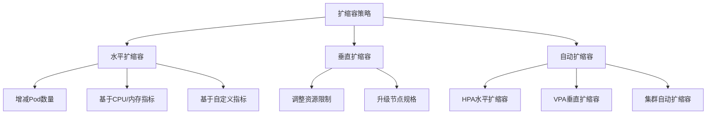

## 💡 面试要点总结

### 设计考虑要素
1. **业务边界**：根据业务能力和数据模型拆分服务
2. **团队结构**：康威定律 - 组织架构决定系统架构
3. **技术成熟度**：团队对分布式系统的掌握程度
4. **运维能力**：监控、部署、故障处理能力

### 架构权衡
- **复杂性 vs 灵活性**：分布式复杂度 vs 独立演进能力
- **性能 vs 隔离性**：网络调用开销 vs 故障隔离
- **一致性 vs 可用性**：强一致性 vs 系统可用性
- **标准化 vs 自主性**：统一标准 vs 技术自主选择

### 成功要素
1. **渐进式演进**：从单体逐步拆分，避免大爆炸式重构
2. **文化转变**：DevOps文化、自动化运维能力
3. **工具链完善**：监控、部署、测试工具支持
4. **组织调整**：小团队、全栈职责、快速响应

### 常见陷阱
❌ **过度拆分**：拆分过细导致管理复杂度爆炸
❌ **数据耦合**：服务间直接共享数据库
❌ **分布式单体**：服务间强依赖，失去微服务优势
❌ **忽视运维**：只关注开发，忽视部署和监控

## 🔗 相关链接

- [← 返回系统设计主页](./README.md)
- [分布式系统](./distributed-systems.md)
- [API设计](./api-design.md)
- [容错与恢复](./fault-tolerance.md)

---

*微服务架构是现代大型系统的主流选择，但需要在复杂性和收益之间找到平衡* 🏗️ 