# 监控与可观测性

## 🎯 核心知识点

- 监控指标体系
- 日志管理与分析
- 链路追踪与调用链
- 告警系统设计
- 可观测性三大支柱

## 📊 可观测性架构设计

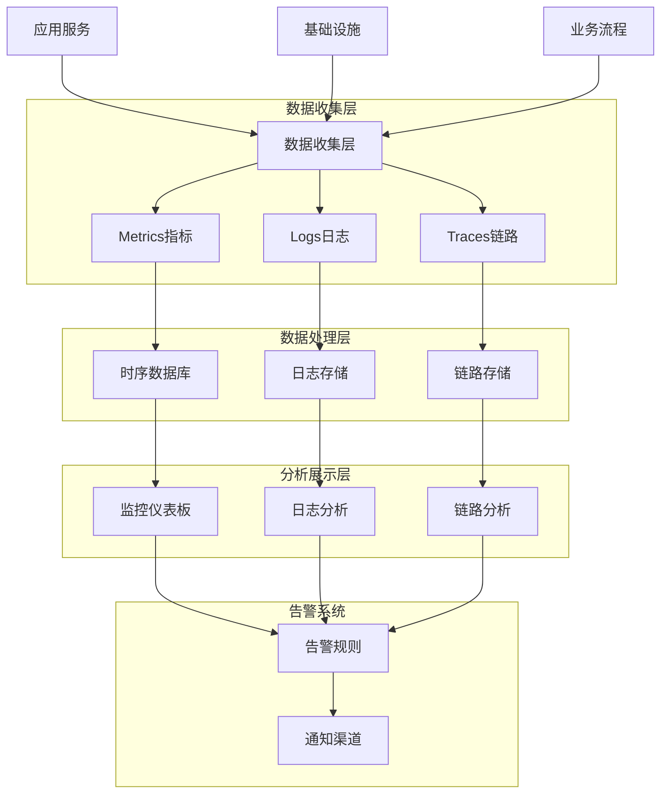

## 💡 面试题目

### **初级** 监控指标体系设计
**题目：** 设计一个Web服务的监控指标体系，包括系统指标、应用指标和业务指标。

**答案要点：**

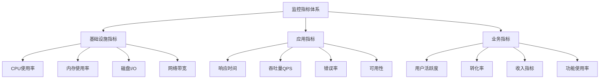

**四个黄金指标（Golden Signals）：**

| 指标 | 描述 | 计算方式 | 告警阈值 |
|------|------|----------|----------|
| 延迟 | 请求处理时间 | P95、P99响应时间 | P95 > 100ms |
| 流量 | 请求数量 | QPS、每秒事务数 | 超过容量80% |
| 错误 | 错误请求比例 | 错误率 = 错误数/总请求数 | 错误率 > 1% |
| 饱和度 | 资源利用率 | CPU、内存、磁盘使用率 | 使用率 > 80% |

### **中级** 分布式链路追踪系统
**题目：** 设计一个微服务架构的分布式链路追踪系统，能够追踪请求在多个服务间的调用路径。

**答案要点：**

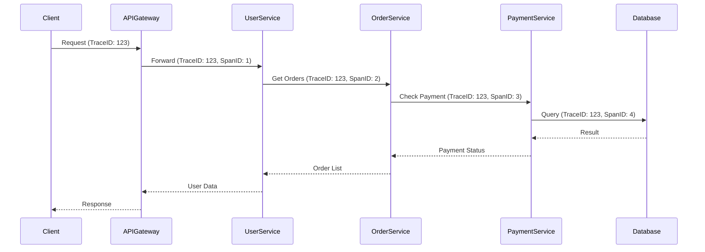

**链路追踪核心概念：**

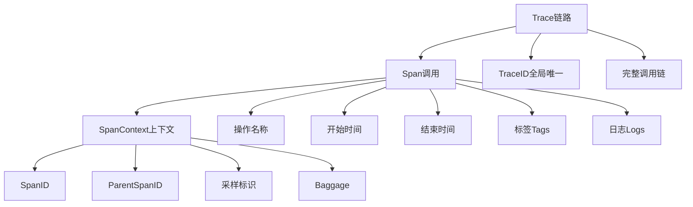

### **高级** 智能告警系统设计
**题目：** 设计一个智能告警系统，能够减少告警疲劳，提供根因分析和自动化处理能力。

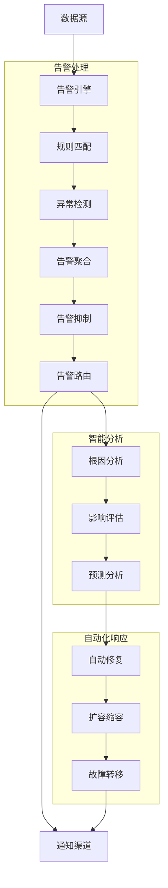

## 📈 监控指标设计

### RED方法 vs USE方法

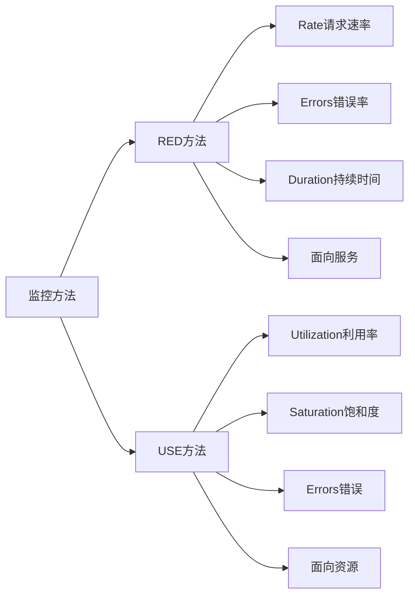

### 监控指标分层架构

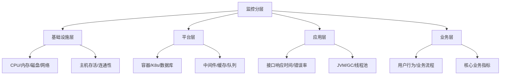

## 🔍 日志管理系统

### 日志架构设计

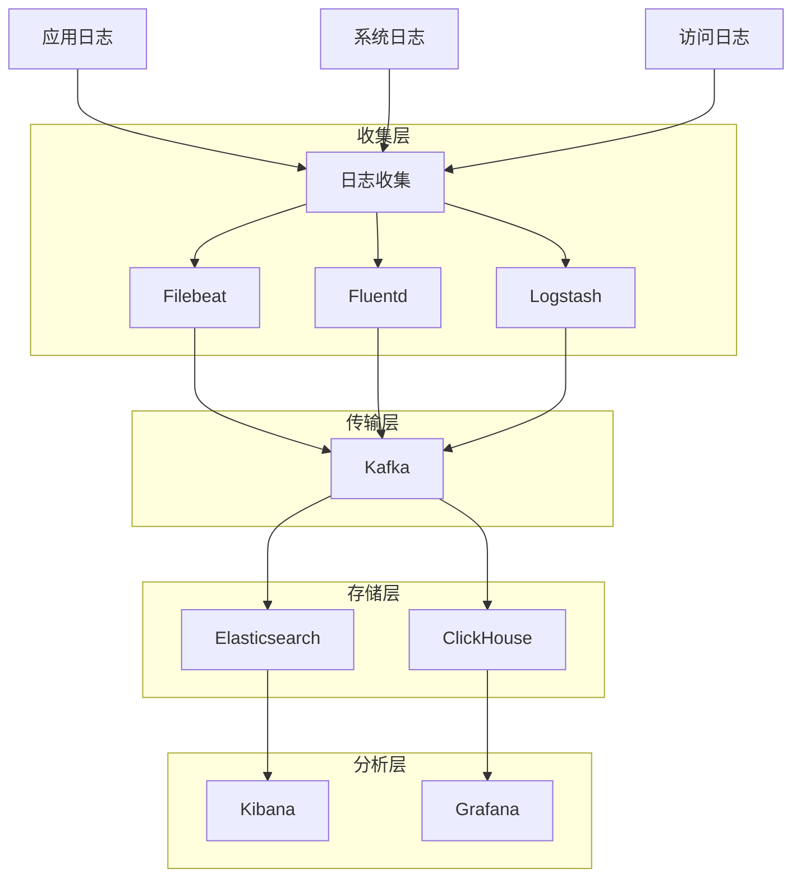

### 结构化日志格式

```json
{
  "timestamp": "2024-01-15T10:30:00Z",
  "level": "INFO",
  "service": "user-service",
  "traceId": "abc123",
  "spanId": "def456",
  "userId": "user123",
  "action": "login",
  "duration": 150,
  "status": "success",
  "message": "User login successful",
  "metadata": {
    "ip": "192.168.1.100",
    "userAgent": "Mozilla/5.0...",
    "version": "1.2.3"
  }
}
```

### 日志级别与用途

| 级别 | 用途 | 示例场景 | 生产环境 |
|------|------|----------|----------|
| TRACE | 详细执行流程 | 函数调用轨迹 | 否 |
| DEBUG | 调试信息 | 变量值、条件判断 | 否 |
| INFO | 关键业务信息 | 用户操作、系统状态 | 是 |
| WARN | 潜在问题 | 配置缺失、性能问题 | 是 |
| ERROR | 错误信息 | 异常、失败操作 | 是 |
| FATAL | 致命错误 | 系统崩溃 | 是 |

## 🔗 链路追踪实现

### OpenTelemetry标准

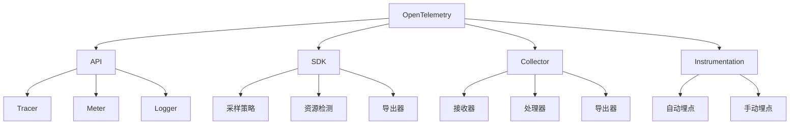

### 采样策略

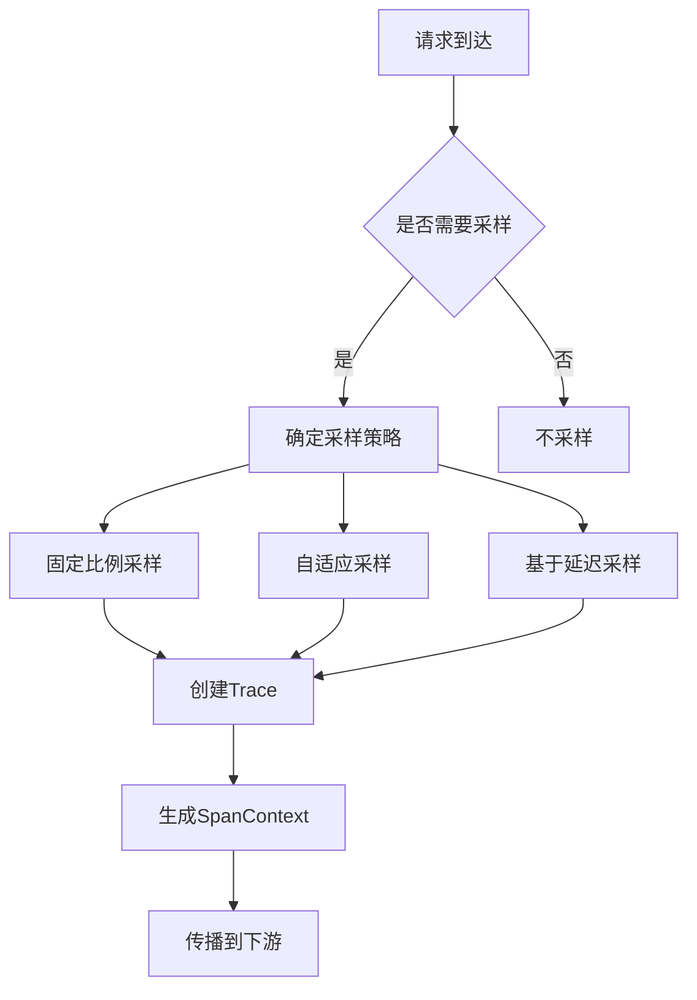

## 🚨 告警系统设计

### 告警规则引擎

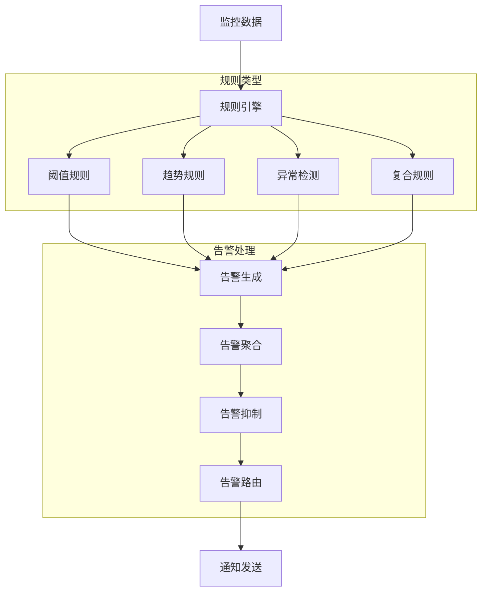

### 告警降噪策略

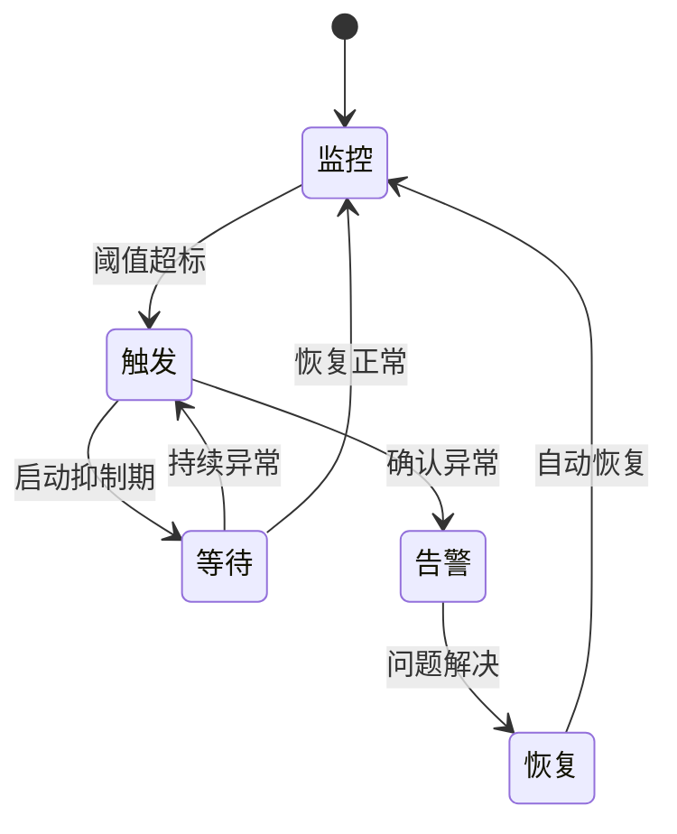

### 告警级别与响应

| 级别 | 描述 | 响应时间 | 通知方式 | 升级策略 |
|------|------|----------|----------|----------|
| P0-致命 | 服务完全不可用 | 5分钟 | 电话+短信+邮件 | 立即升级 |
| P1-严重 | 核心功能受影响 | 15分钟 | 短信+邮件 | 30分钟升级 |
| P2-重要 | 部分功能异常 | 30分钟 | 邮件+IM | 2小时升级 |
| P3-一般 | 性能问题 | 1小时 | 邮件 | 24小时升级 |
| P4-轻微 | 潜在风险 | 24小时 | 邮件 | 无升级 |

## 🛠️ 技术栈选型

### 监控技术栈对比

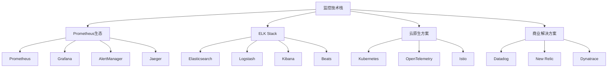

### 存储方案选择

| 数据类型 | 存储方案 | 特点 | 适用场景 |
|----------|----------|------|----------|
| 时序指标 | Prometheus/InfluxDB | 高写入性能 | 监控指标 |
| 日志数据 | Elasticsearch/ClickHouse | 全文搜索 | 日志分析 |
| 链路数据 | Jaeger/Zipkin | 图数据库 | 链路追踪 |
| 事件数据 | Kafka/RabbitMQ | 消息队列 | 事件流处理 |

## 📋 实施最佳实践

### 监控即代码

```yaml
# 监控规则示例
groups:
  - name: api_monitoring
    rules:
      - alert: HighErrorRate
        expr: sum(rate(http_requests_total{status=~"5.."}[5m])) / sum(rate(http_requests_total[5m])) > 0.01
        for: 5m
        labels:
          severity: warning
        annotations:
          summary: "High error rate detected"
          description: "Error rate is {{ $value | humanizePercentage }}"
      
      - alert: HighLatency
        expr: histogram_quantile(0.95, sum(rate(http_request_duration_seconds_bucket[5m])) by (le)) > 0.1
        for: 5m
        labels:
          severity: critical
        annotations:
          summary: "High latency detected"
```

### 仪表板设计原则

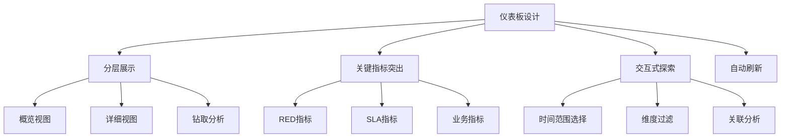

## 💡 面试要点总结

### 可观测性三大支柱
1. **Metrics指标**：定量数据，反映系统状态
2. **Logs日志**：离散事件，提供详细上下文
3. **Traces链路**：请求流转，展示调用关系

### 监控设计原则
- **业务优先**：从业务角度设计监控指标
- **分层监控**：基础设施→应用→业务多层监控
- **主动监控**：预测性监控，提前发现问题
- **自动化运维**：监控驱动的自动化处理

### 告警系统要点
- **有效性**：准确识别真正的问题
- **及时性**：在问题影响用户前发现
- **可操作性**：提供明确的处理指导
- **可扩展性**：支持规则动态配置

### 性能优化策略
- **采样策略**：平衡监控精度和性能开销
- **数据压缩**：减少存储和传输成本
- **批量处理**：提高数据处理效率
- **缓存机制**：加速查询响应

### 常见问题与解决方案

| 问题 | 影响 | 解决方案 |
|------|------|----------|
| 告警风暴 | 影响响应效率 | 告警聚合、抑制规则 |
| 数据孤岛 | 缺乏全局视角 | 统一监控平台 |
| 存储成本高 | 运维成本上升 | 数据分层、自动清理 |
| 查询性能差 | 影响故障排查 | 索引优化、预聚合 |

## 🔗 相关链接

- [← 返回系统设计主页](./README.md)
- [分布式系统](./distributed-systems.md)
- [微服务架构](./microservices-architecture.md)
- [安全架构设计](./security-architecture.md)

---

*可观测性是现代分布式系统的基础设施，为系统稳定性提供重要保障* 📊 