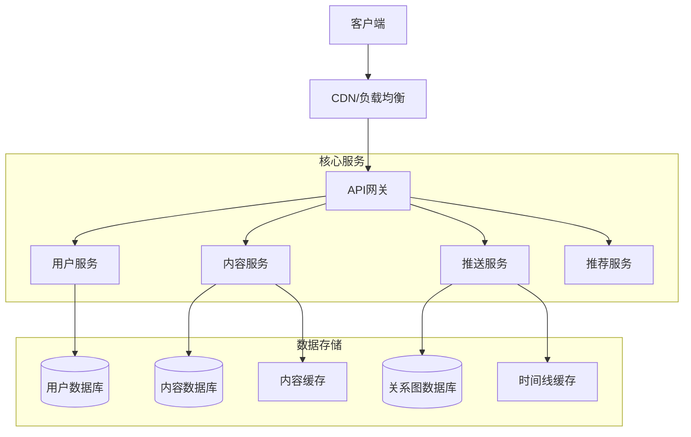
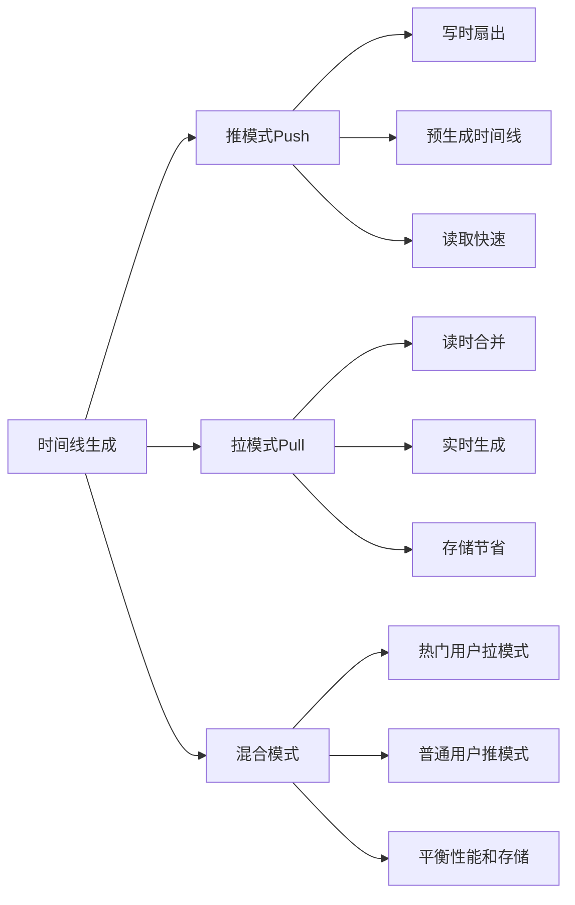
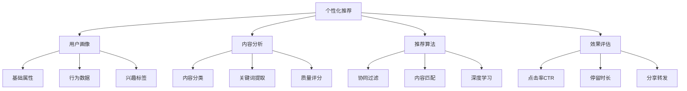
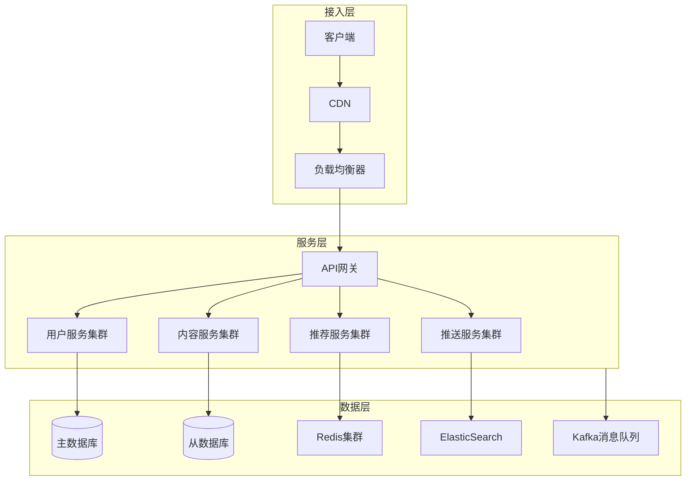
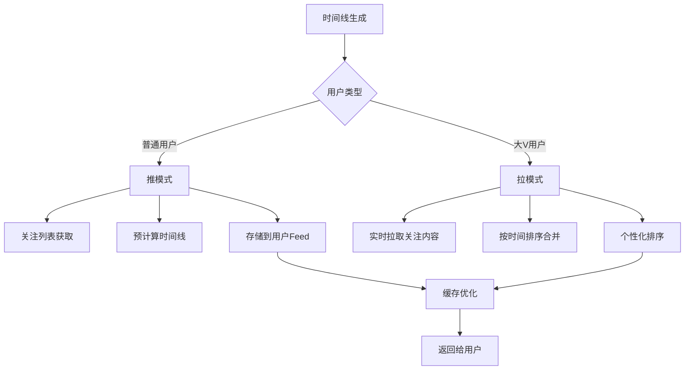
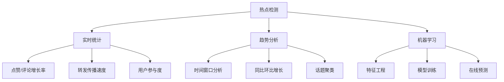
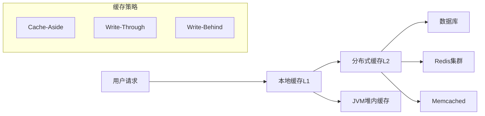
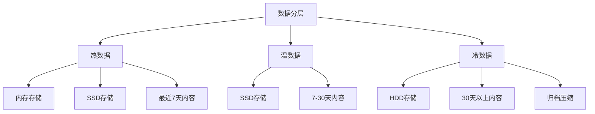
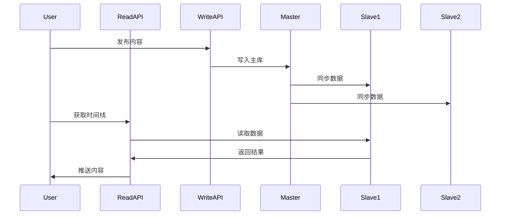

# 设计新闻推送系统

## 🎯 核心知识点

- 推拉模式设计
- 时间线生成算法  
- 个性化推荐
- 缓存策略优化
- 实时性保证

## 📊 系统整体架构

## 💡 面试题目

### **初级** 推拉模式对比
**题目：** 设计Twitter/微博的时间线功能，对比推模式和拉模式的优缺点。

**答案要点：**

**模式对比分析：**

| 维度 | 推模式(Push) | 拉模式(Pull) | 混合模式 |
|------|-------------|-------------|----------|
| 读取性能 | 快速 | 较慢 | 中等 |
| 写入性能 | 慢 | 快速 | 中等 |
| 存储成本 | 高 | 低 | 中等 |
| 实时性 | 好 | 一般 | 好 |
| 扩展性 | 复杂 | 简单 | 中等 |

### **中级** 个性化推荐算法
**题目：** 如何实现个性化的新闻推送？包括内容相关性计算和用户兴趣建模。

**答案要点：**

### **高级** 大规模系统优化
**题目：** 支持亿级用户的新闻推送系统如何设计？考虑性能、可用性、一致性。

## ⚡ 核心算法设计

### 时间线生成算法

### 热点内容检测

## 🛡️ 系统优化策略

### 缓存层次设计

### 数据存储分层

## 📈 性能优化

### 读写分离架构

### 分片策略

| 分片方式 | 优势 | 劣势 | 适用场景 |
|----------|------|------|----------|
| 用户ID分片 | 负载均衡 | 热点用户问题 | 用户数据存储 |
| 时间分片 | 查询效率高 | 热点时间问题 | 历史数据归档 |
| 内容类型分片 | 业务隔离 | 跨类型查询复杂 | 多媒体内容 |
| 混合分片 | 灵活性好 | 复杂度高 | 大规模系统 |

## 💡 面试要点总结

### 关键设计要点
1. **用户规模评估**：日活用户数、发布频率、读写比例
2. **性能目标**：响应时间、吞吐量、可用性指标
3. **存储容量规划**：内容大小、保存时长、增长预期
4. **成本控制**：存储成本、计算成本、带宽成本

### 技术选型考虑
- **数据库选择**：关系型 vs NoSQL vs 图数据库
- **缓存策略**：本地缓存 vs 分布式缓存
- **消息队列**：实时推送 vs 批量处理
- **搜索引擎**：全文检索 vs 推荐算法

### 扩展性设计
1. **水平扩展**：无状态服务、数据分片
2. **垂直扩展**：硬件升级、性能优化
3. **地域扩展**：CDN部署、就近访问
4. **功能扩展**：插件化架构、微服务拆分

## 🔗 相关链接

- [← 返回系统设计主页](./README.md)
- [缓存系统](./caching-systems.md)
- [推荐系统](./recommendation-system.md)
- [高并发处理](./high-concurrency.md)

---

*新闻推送系统是社交媒体的核心功能，体现了分布式系统设计的多个重要方面* 📰 