# 通知系统设计

## 🎯 核心知识点

- 多渠道通知架构
- 消息可靠性保证
- 推送策略与个性化
- 大规模推送优化
- 通知去重与合并

## 📊 通知系统架构设计

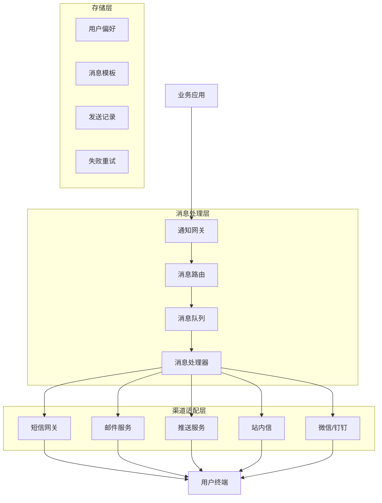

## 💡 面试题目

### **初级** 多渠道通知设计
**题目：** 设计一个支持短信、邮件、推送的多渠道通知系统，确保消息能够可靠送达。

**答案要点：**

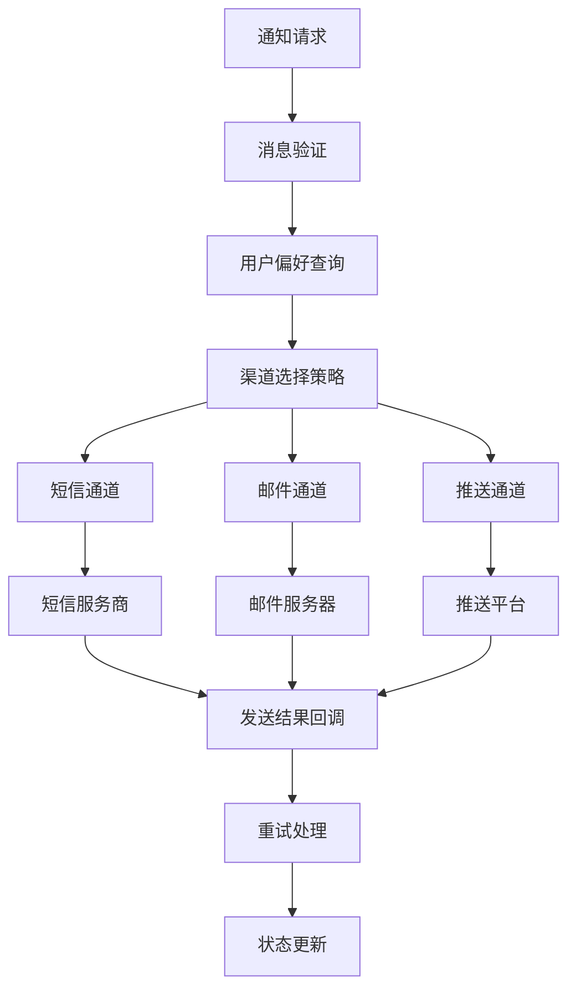

**渠道选择策略：**

| 场景 | 优先渠道 | 备用渠道 | 选择原因 |
|------|----------|----------|----------|
| 紧急通知 | 短信 | 推送+邮件 | 到达率高，即时性好 |
| 营销活动 | 推送 | 邮件 | 成本低，可交互 |
| 账户安全 | 短信+邮件 | 推送 | 双重确认，可信度高 |
| 系统公告 | 站内信 | 推送+邮件 | 持久化保存 |
| 订单状态 | 推送 | 短信 | 实时更新，成本平衡 |

### **中级** 大规模推送系统
**题目：** 设计一个支持千万级用户的推送系统，需要考虑推送速度、成功率和用户体验。

**答案要点：**

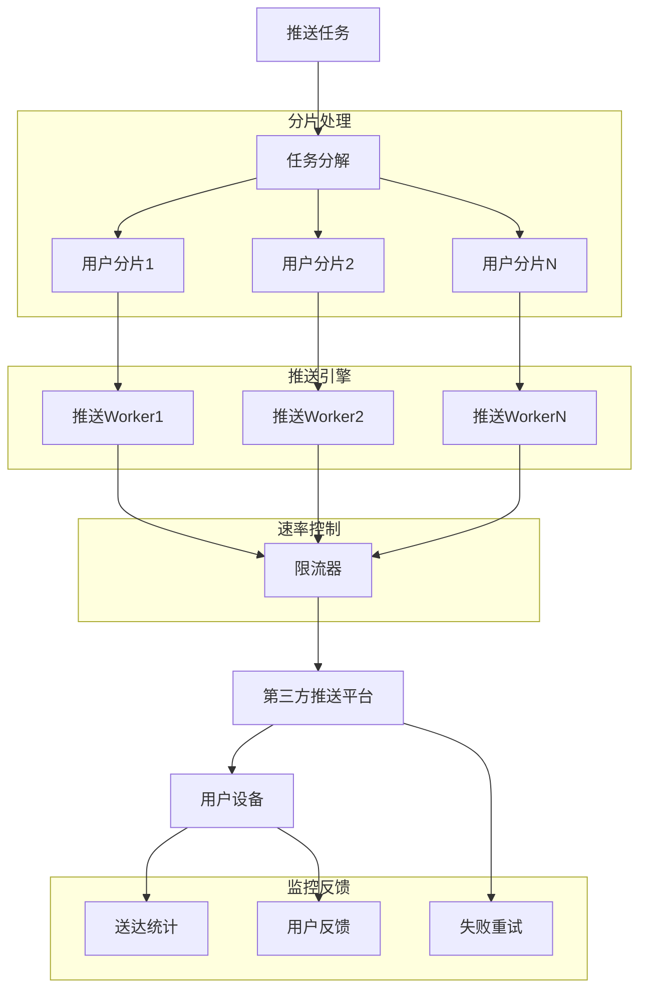

### **高级** 智能推送策略
**题目：** 设计一个智能推送系统，根据用户行为和偏好进行个性化推送，提高用户参与度。

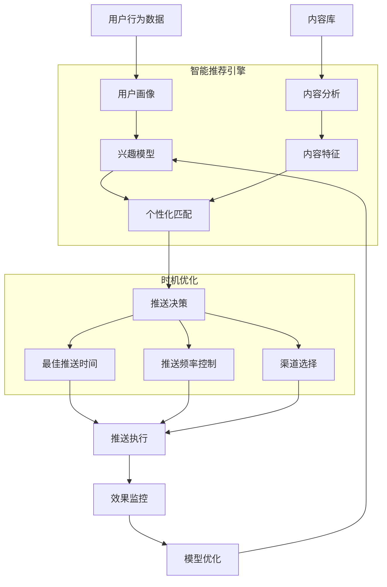

## 📱 推送渠道实现

### App推送架构

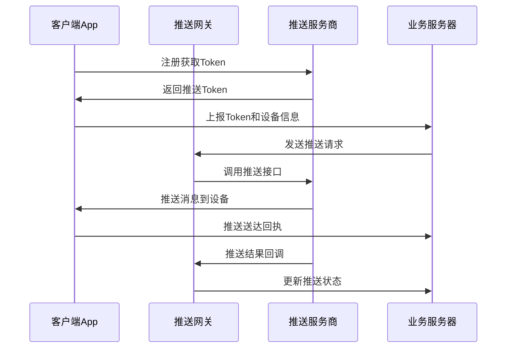

### 推送服务商对比

| 服务商 | 覆盖平台 | 送达率 | 延迟 | 成本 | 特点 |
|--------|----------|--------|------|------|------|
| APNs | iOS | 95%+ | 低 | 免费 | 苹果官方，稳定性好 |
| FCM | Android | 90%+ | 低 | 免费 | Google官方，国外稳定 |
| 华为推送 | Android | 95%+ | 低 | 免费 | 华为设备优势明显 |
| 小米推送 | Android | 90%+ | 低 | 免费 | 小米设备专用 |
| 极光推送 | 全平台 | 85%+ | 中等 | 付费 | 第三方，集成简单 |
| 友盟推送 | 全平台 | 85%+ | 中等 | 付费 | 阿里系，功能丰富 |

### 推送消息格式

```json
{
  "notification": {
    "title": "订单状态更新",
    "body": "您的订单已发货，预计明天送达",
    "icon": "order_icon",
    "sound": "default",
    "badge": 1,
    "click_action": "ORDER_DETAIL"
  },
  "data": {
    "order_id": "12345",
    "status": "shipped",
    "tracking_number": "SF1234567890",
    "extra_data": "{\"promotion_id\": \"promo_001\"}"
  },
  "android": {
    "priority": "high",
    "ttl": "3600s",
    "collapse_key": "order_update"
  },
  "apns": {
    "headers": {
      "apns-priority": "10",
      "apns-expiration": "1640995200"
    },
    "payload": {
      "aps": {
        "alert": {
          "title": "订单状态更新",
          "body": "您的订单已发货，预计明天送达"
        },
        "badge": 1,
        "sound": "default"
      }
    }
  }
}
```

## 📧 邮件通知系统

### 邮件发送架构

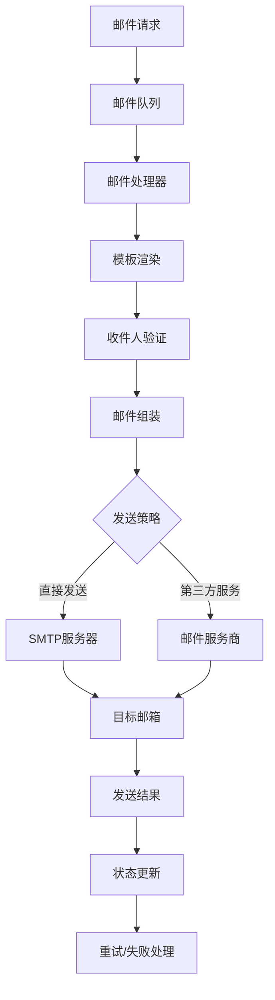

### 邮件模板系统

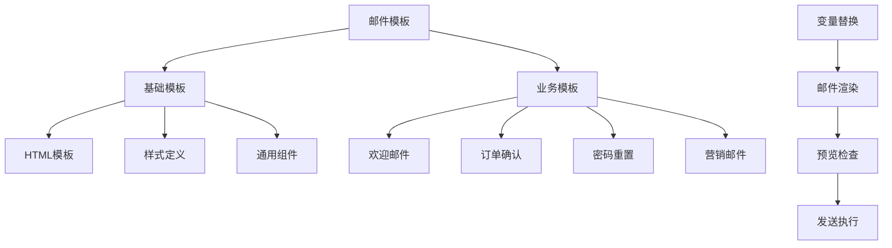

## 📲 短信通知系统

### 短信网关架构

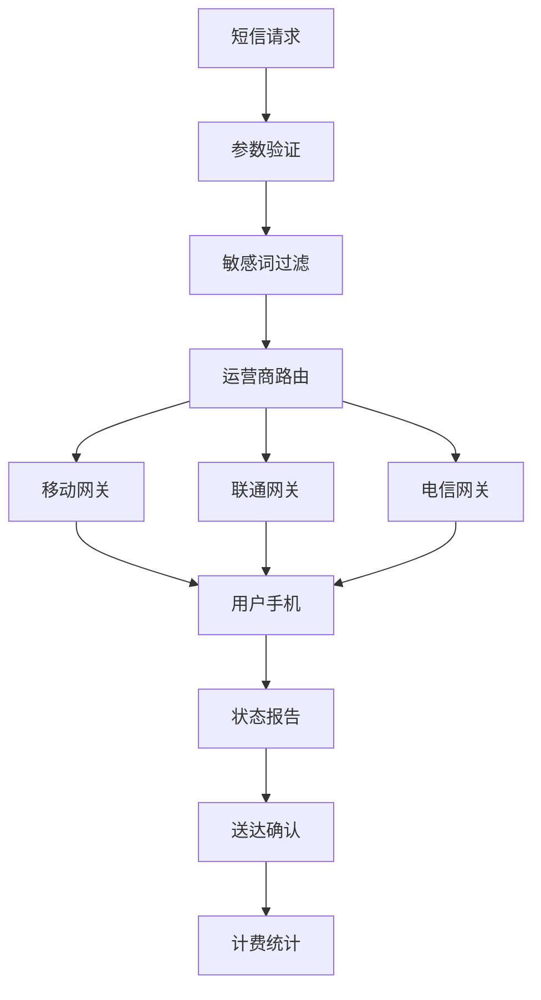

### 短信发送策略

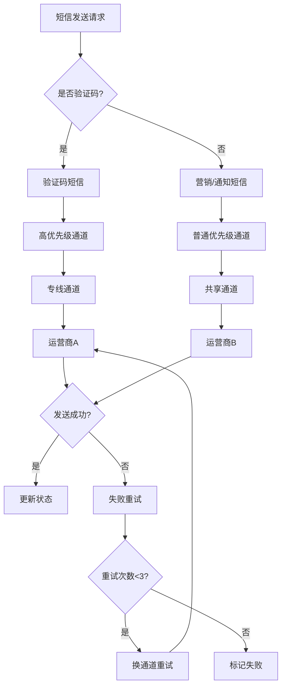

## 🎯 个性化推送策略

### 用户画像构建

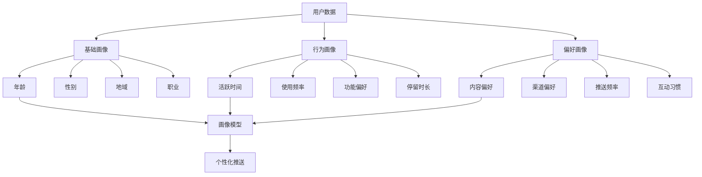

### 推送时机优化

```mermaid
timeline
    title 用户活跃时间分析
    
    section 工作日
        06:00-09:00 : 早高峰<br/>通勤时间<br/>新闻资讯类推送
        12:00-14:00 : 午休时间<br/>娱乐内容推送
        18:00-22:00 : 晚高峰<br/>购物/生活类推送
    
    section 周末
        09:00-11:00 : 休闲时光<br/>娱乐/购物推送
        14:00-17:00 : 下午茶时间<br/>社交/分享类推送
        19:00-23:00 : 黄金时间<br/>全类型推送
```

## 🔧 消息可靠性保证

### 消息状态流转

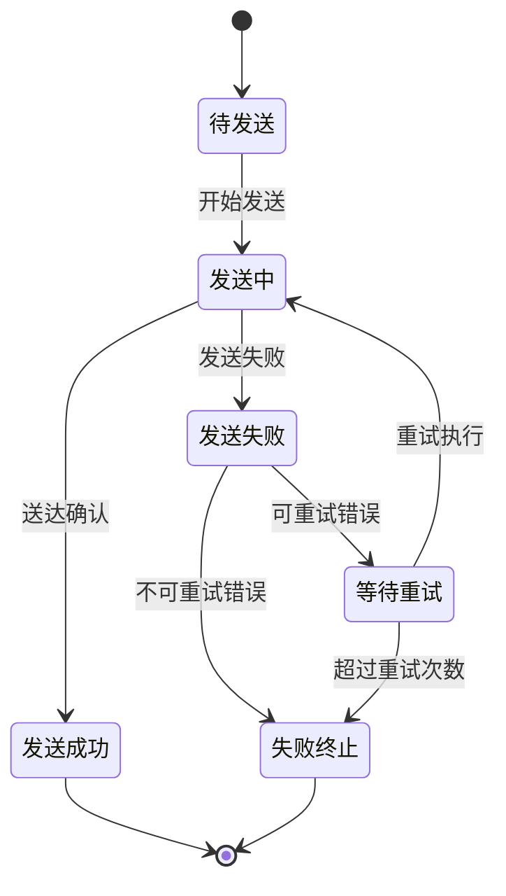

### 消息去重策略

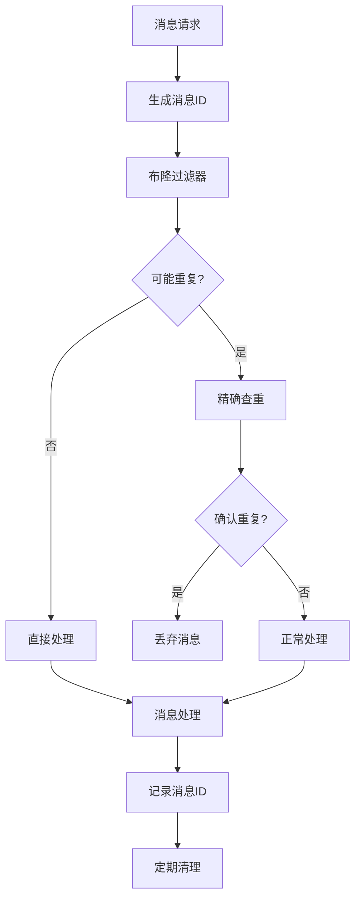

### 重试机制设计

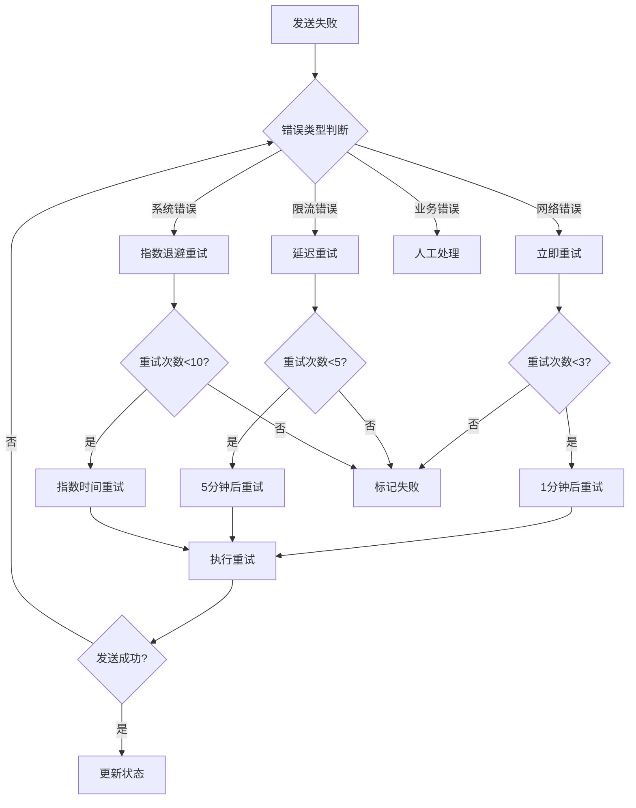

## 📊 监控与分析

### 核心指标监控

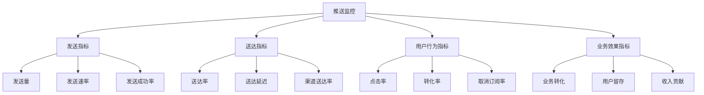

### 实时监控仪表板

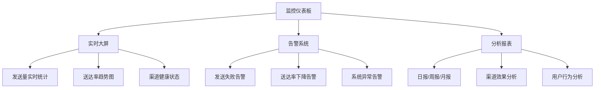

## 💡 面试要点总结

### 系统设计要点
1. **高可用性**：多渠道冗余，故障自动切换
2. **高并发**：消息队列异步处理，分片并行发送
3. **可靠性**：消息持久化，失败重试机制
4. **可扩展性**：微服务架构，水平扩展能力

### 渠道选择策略
- **实时性要求**：短信 > 推送 > 邮件 > 站内信
- **成本控制**：站内信 < 推送 < 邮件 < 短信
- **送达率**：短信 > 邮件 > 推送 > 站内信
- **富媒体支持**：邮件 > 推送 > 站内信 > 短信

### 个性化推送关键
- **用户画像**：基于用户行为和属性建立画像
- **内容推荐**：根据用户兴趣推荐相关内容
- **时机优化**：分析用户活跃时间，选择最佳推送时机
- **频率控制**：避免过度打扰，维护用户体验

### 技术挑战与解决方案

| 挑战 | 解决方案 | 技术选型 |
|------|----------|----------|
| 大规模推送 | 分片并行处理 | Kafka + 多Worker |
| 消息可靠性 | 持久化 + 重试 | Redis + MySQL |
| 送达率优化 | 多渠道 + 智能路由 | 负载均衡算法 |
| 个性化推荐 | 机器学习 + 实时计算 | Spark + 推荐算法 |

### 常见问题与对策
❌ **推送骚扰**：用户取消订阅率高
✅ **解决方案**：智能频率控制，内容个性化

❌ **送达率低**：消息无法及时送达用户
✅ **解决方案**：多渠道备份，运营商优选

❌ **系统过载**：推送高峰期系统性能下降
✅ **解决方案**：削峰填谷，弹性扩容

## 🔗 相关链接

- [← 返回系统设计主页](./README.md)
- [消息队列](./message-queues.md)
- [高并发处理](./high-concurrency.md)
- [用户推荐系统](./recommendation-system.md)

---

*通知系统是用户体验的重要组成部分，需要在及时性和用户体验之间找到平衡* 📢 