# 安全架构设计

## 🎯 核心知识点

- 认证与授权机制
- 数据安全保护
- 网络安全架构
- 安全威胁防护
- 合规性要求

## 📊 安全架构整体设计

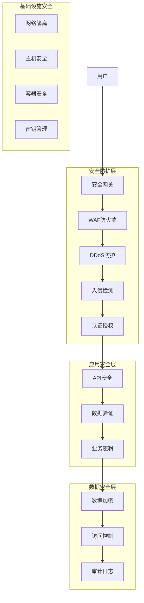

## 💡 面试题目

### **初级** 认证与授权设计
**题目：** 设计一个企业应用的用户认证和权限管理系统，支持多种登录方式和细粒度权限控制。

**答案要点：**

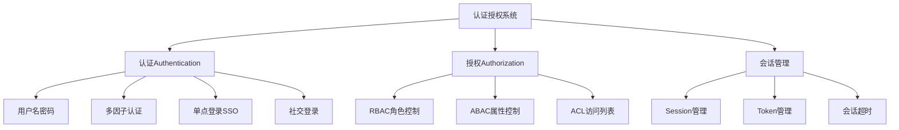

**认证方式对比：**

| 认证方式 | 安全级别 | 用户体验 | 实现复杂度 | 适用场景 |
|----------|----------|----------|------------|----------|
| 用户名密码 | 中等 | 简单 | 低 | 基础应用 |
| 短信验证码 | 中等 | 一般 | 中等 | 移动应用 |
| 多因子认证 | 高 | 复杂 | 高 | 敏感系统 |
| 生物识别 | 高 | 便捷 | 高 | 移动设备 |
| 硬件Token | 很高 | 复杂 | 高 | 企业系统 |

### **中级** 数据安全保护策略
**题目：** 设计一个处理敏感数据的系统，需要考虑数据的加密、脱敏、备份和合规要求。

**答案要点：**

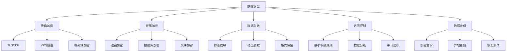

**数据分级保护策略：**

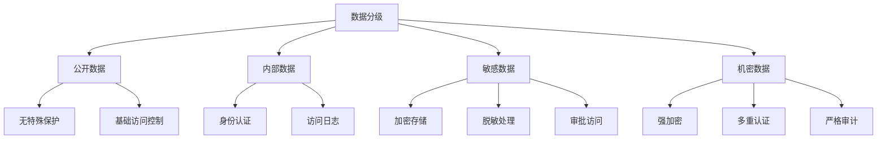

### **高级** 零信任安全架构
**题目：** 设计一个基于零信任原则的企业安全架构，实现"永不信任，始终验证"。

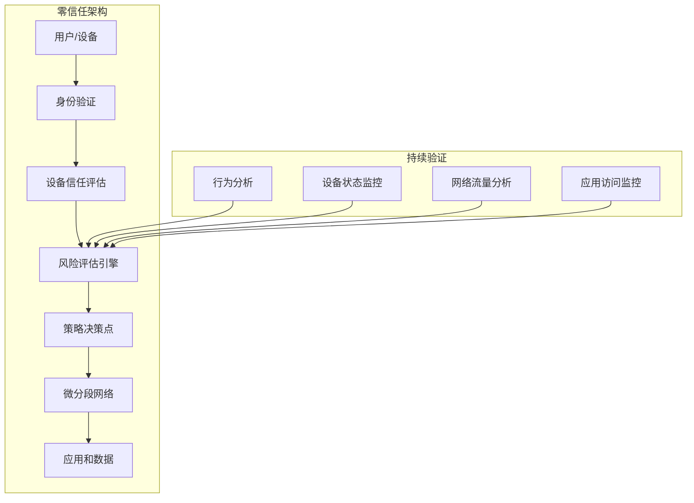

## 🛡️ 安全威胁防护

### 常见Web安全威胁

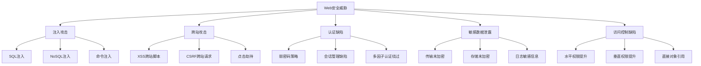

### OWASP Top 10防护措施

| 威胁 | 防护措施 | 技术实现 |
|------|----------|----------|
| 注入攻击 | 参数化查询、输入验证 | ORM框架、WAF |
| 认证缺陷 | 强密码策略、MFA | OAuth、JWT |
| 敏感数据泄露 | 加密传输和存储 | TLS、数据库加密 |
| XXE攻击 | 禁用外部实体解析 | XML解析器配置 |
| 访问控制缺陷 | 最小权限原则 | RBAC、API权限检查 |
| 安全配置错误 | 安全基线、定期扫描 | 配置管理、漏洞扫描 |
| XSS攻击 | 输出编码、CSP | 内容安全策略 |
| 不安全反序列化 | 输入验证、签名检查 | 安全序列化库 |
| 已知漏洞组件 | 依赖管理、定期更新 | 漏洞扫描工具 |
| 日志监控不足 | 完整日志、实时监控 | SIEM系统 |

## 🔧 技术实现

### JWT Token安全设计

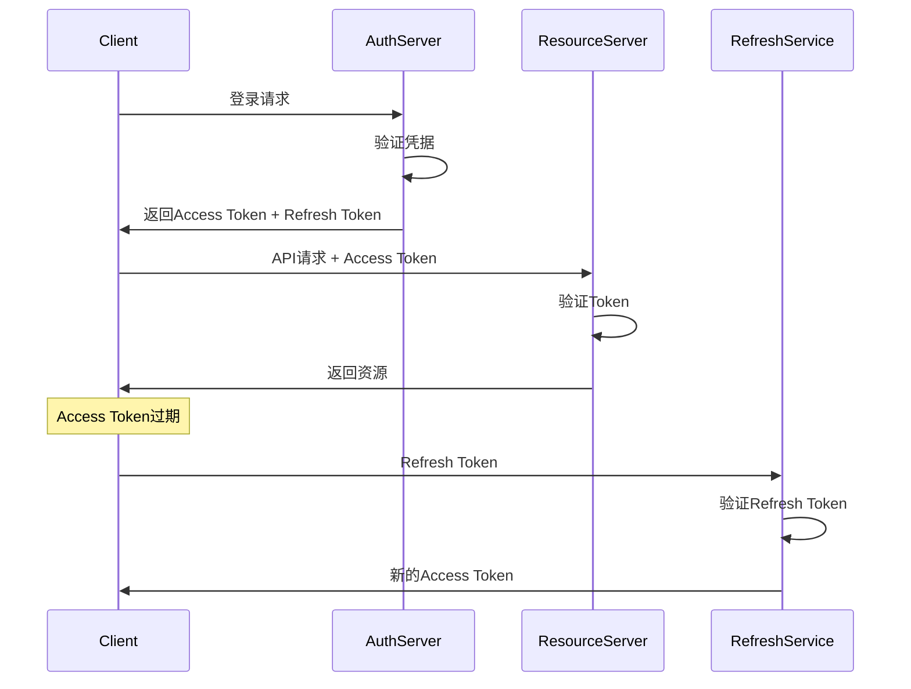

**JWT安全最佳实践：**
- 使用强加密算法（RS256而非HS256）
- 设置合理的过期时间（Access Token短期，Refresh Token长期）
- 实现Token刷新机制
- 存储在HttpOnly Cookie中
- 添加防重放攻击机制

### API安全网关设计

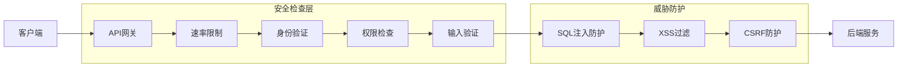

## 📈 监控与检测

### 安全监控体系

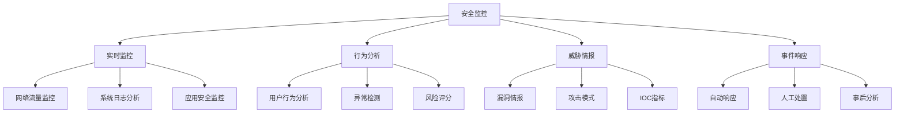

### 安全事件处理流程

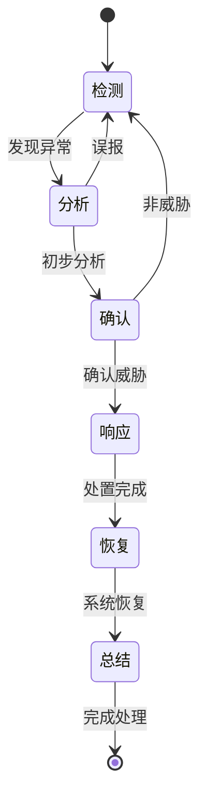

## 🔒 合规性要求

### 主要安全合规标准

| 标准 | 适用行业 | 主要要求 |
|------|----------|----------|
| GDPR | 欧盟数据处理 | 数据保护、用户权利 |
| SOX | 上市公司 | 财务数据完整性 |
| HIPAA | 医疗行业 | 健康信息保护 |
| PCI DSS | 支付行业 | 信用卡数据安全 |
| ISO 27001 | 通用 | 信息安全管理 |

### 数据隐私保护

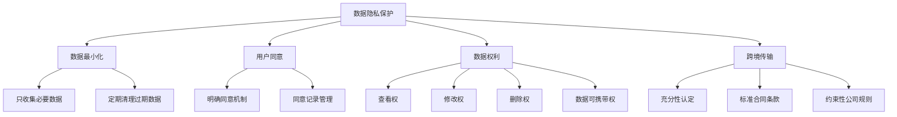

## 💡 面试要点总结

### 安全设计原则
1. **纵深防御**：多层安全控制，单点失效不会导致整体失效
2. **最小权限**：用户和系统只获得完成任务所需的最小权限
3. **默认安全**：系统默认配置应该是安全的
4. **安全透明**：安全机制对用户应该是透明的

### 威胁建模
1. **识别资产**：确定需要保护的数据和系统
2. **识别威胁**：分析可能的攻击向量
3. **评估风险**：计算威胁的影响和可能性
4. **确定对策**：选择合适的安全控制措施

### 安全测试
- **静态代码分析**：发现代码中的安全漏洞
- **动态安全测试**：运行时安全漏洞检测
- **渗透测试**：模拟真实攻击场景
- **安全审计**：定期检查安全配置和策略

### 常见误区
❌ **安全是事后考虑**：应该在设计阶段就考虑安全
❌ **依赖单一防护**：需要多层防护机制
❌ **忽视内部威胁**：内部用户也可能是威胁源
❌ **静态安全策略**：安全策略需要持续更新

## 🔗 相关链接

- [← 返回系统设计主页](./README.md)
- [API设计](./api-design.md)
- [微服务架构](./microservices-architecture.md)
- [监控与可观测性](./monitoring-observability.md)

---

*安全是系统设计的基础要求，需要在架构设计的每个层面都考虑安全因素* 🔐 