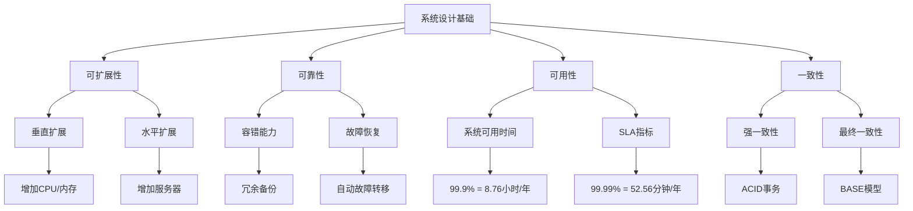
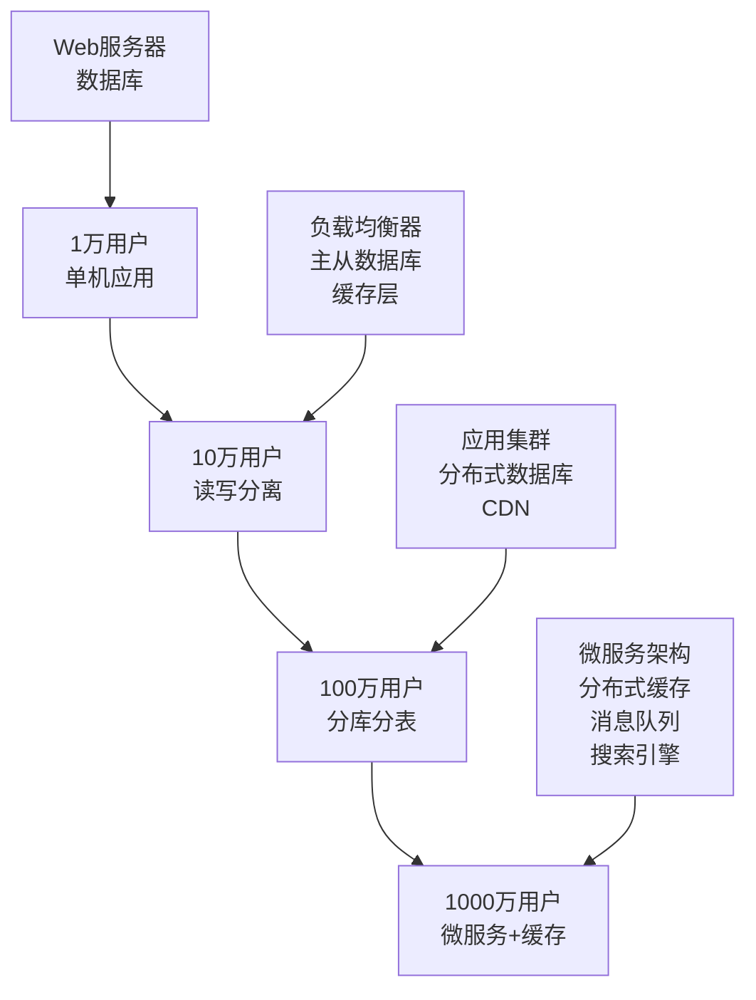
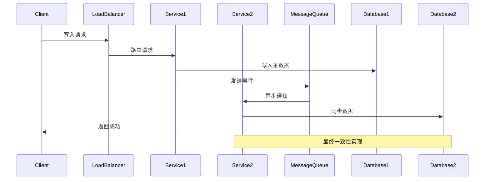

# 系统设计基础

## 🎯 核心知识点

- 可扩展性（Scalability）
- 可靠性（Reliability）
- 可用性（Availability）
- 一致性（Consistency）
- 分区容错性（Partition Tolerance）
- 延迟（Latency）vs 吞吐量（Throughput）

## 📊 系统设计核心概念关系图

## 💡 面试题目

### **初级** CAP理论基础
**题目：** 请解释CAP理论，并举例说明在实际系统中如何进行权衡？

**答案要点：**
- **一致性（Consistency）**：所有节点同时看到相同的数据
- **可用性（Availability）**：系统在任何时候都能响应请求  
- **分区容错性（Partition Tolerance）**：系统在网络分区时仍能继续运行
- **权衡选择**：
  - CP系统：MongoDB、Redis（优先一致性）
  - AP系统：Cassandra、DynamoDB（优先可用性）
  - CA系统：RDBMS（在没有网络分区时）

**扩展思考：**
- 为什么不能同时满足CAP三个特性？
- PACELC理论如何扩展了CAP理论？

### **中级** 可扩展性设计
**题目：** 设计一个支持从1万用户扩展到1000万用户的系统架构演进方案。

**答案要点：**

**扩展思考：**
- 每个阶段的性能瓶颈是什么？
- 如何选择合适的扩展时机？

### **高级** 分布式系统一致性
**题目：** 在分布式环境下，如何实现最终一致性？请设计一个具体的解决方案。

**答案要点：**

**实现策略：**
1. **事件驱动架构**：通过消息队列异步同步数据
2. **补偿机制**：定期检查和修复不一致数据
3. **版本控制**：使用向量时钟或版本号解决冲突
4. **读取策略**：读取时合并多个数据源的结果

## 🔧 性能指标对比

| 指标类型 | 优秀 | 良好 | 可接受 | 需要优化 |
|---------|------|------|--------|----------|
| 响应时间 | <100ms | <300ms | <1s | >1s |
| 可用性 | 99.99% | 99.9% | 99% | <99% |
| 吞吐量 | >10K QPS | >1K QPS | >100 QPS | <100 QPS |
| 错误率 | <0.01% | <0.1% | <1% | >1% |

## 📚 扩展阅读

### 设计原则
1. **单一职责原则**：每个组件只做一件事
2. **开闭原则**：对扩展开放，对修改关闭
3. **松耦合高内聚**：降低系统复杂度
4. **异步处理**：提高系统响应性能
5. **幂等性设计**：保证操作可重复执行

### 常见反模式
- ❌ **大泥球**：没有清晰的架构结构
- ❌ **过度设计**：为了未来可能不存在的需求
- ❌ **单点故障**：系统中存在关键故障点
- ❌ **共享数据库**：多个服务共用同一个数据库

## 🔗 相关链接

- [← 返回系统设计主页](./README.md)
- [分布式系统](./distributed-systems.md)
- [负载均衡](./load-balancing.md)
- [数据库设计](./database-design.md)

---

*理解这些基础概念是掌握系统设计的第一步* 🎯 