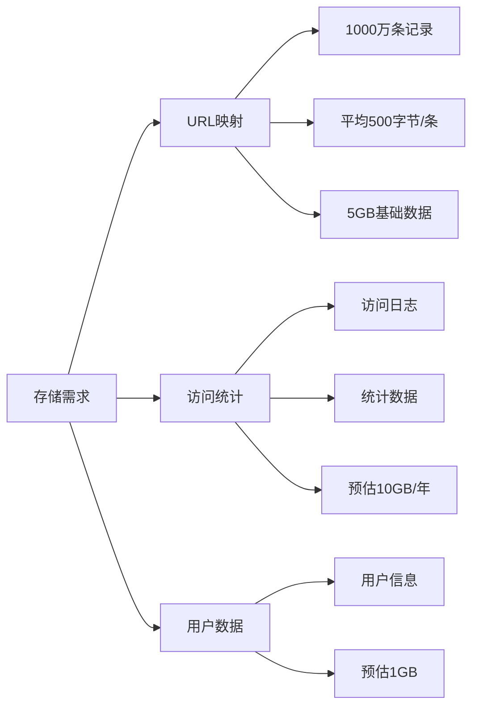
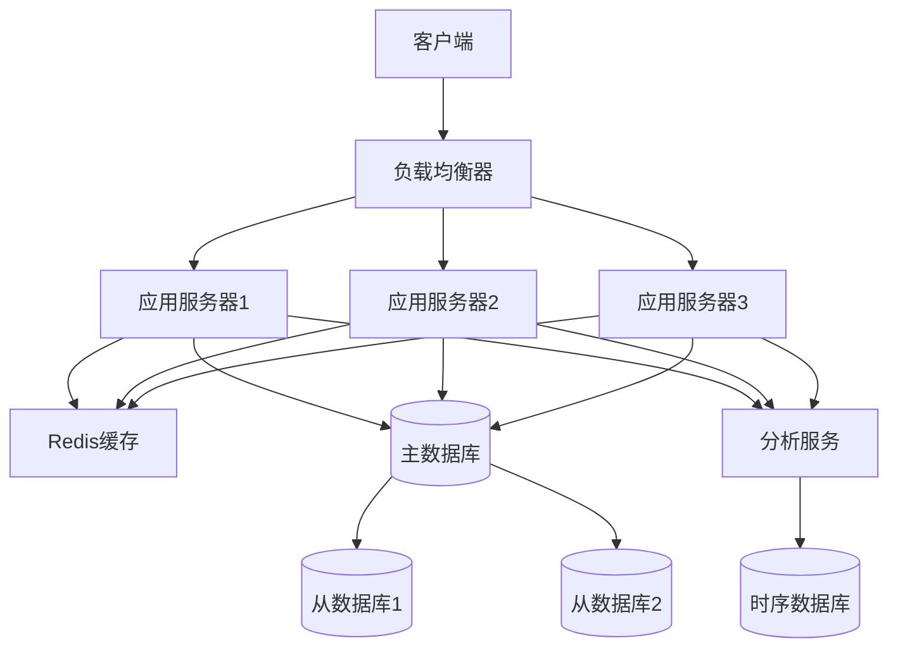
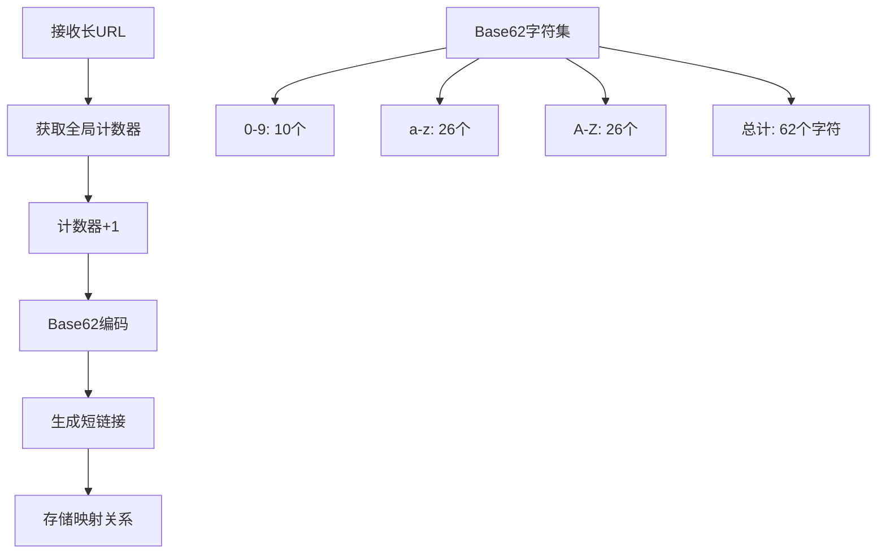
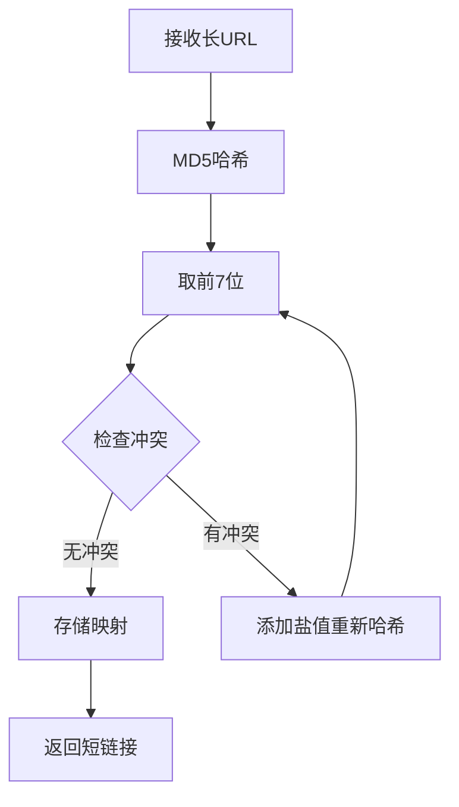
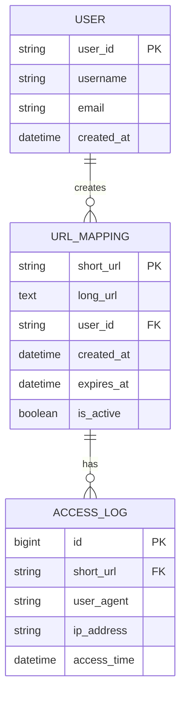
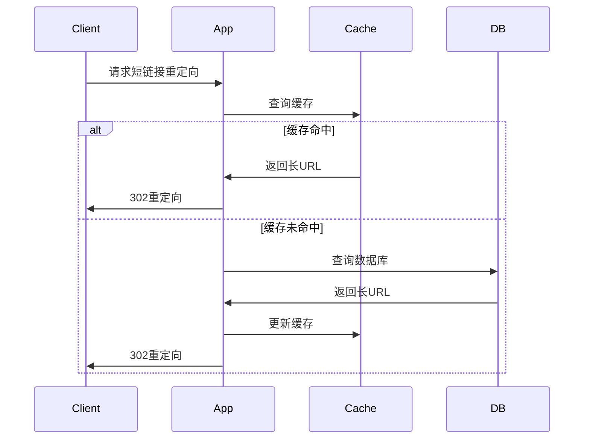
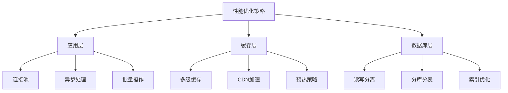
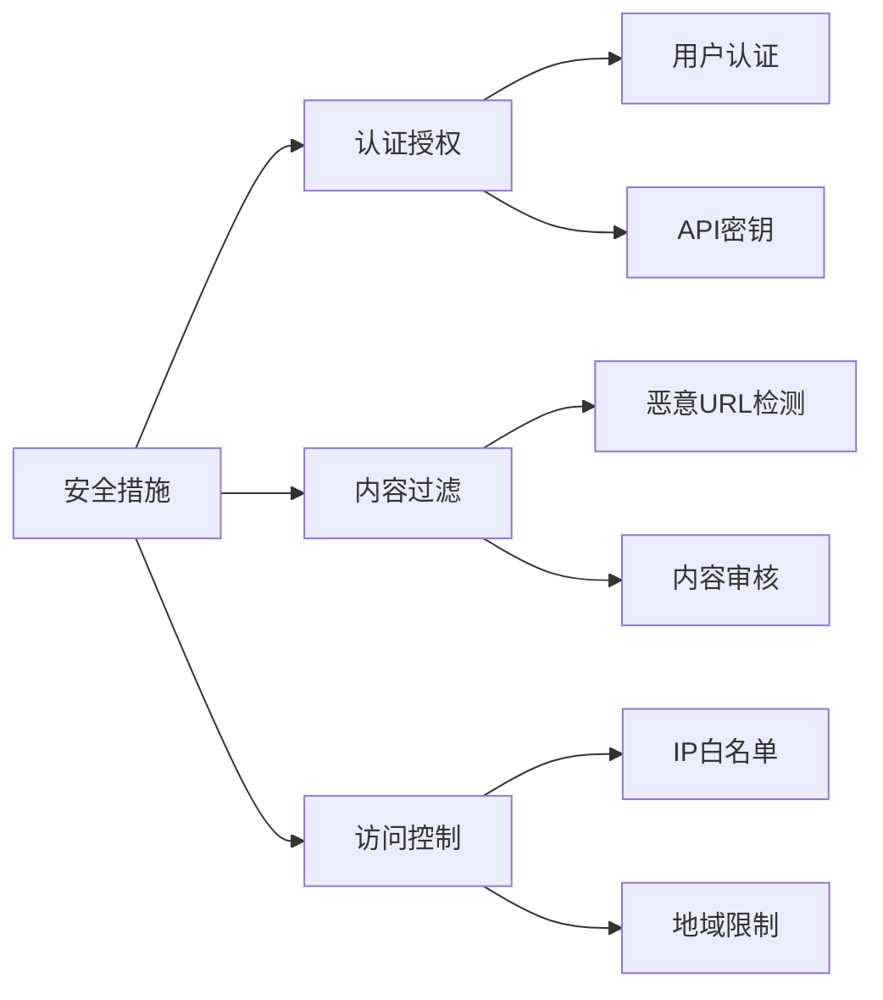
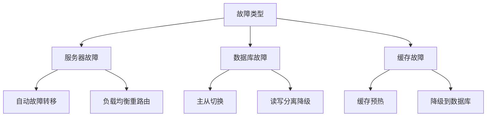

# 设计短链接服务

## 🎯 题目描述

设计一个类似 bit.ly 或 TinyURL 的短链接服务，能够将长URL转换为短URL，并支持重定向功能。

## 📋 需求分析

### 功能需求
1. **URL缩短**：将长URL转换为短URL
2. **URL重定向**：通过短URL跳转到原始长URL  
3. **自定义短链**：用户可以自定义短链接后缀
4. **链接过期**：支持设置链接过期时间
5. **访问统计**：统计短链接的访问次数

### 非功能需求
1. **高可用性**：99.9%以上的可用性
2. **低延迟**：URL重定向延迟<100ms
3. **高并发**：支持10万QPS的读取操作
4. **存储容量**：支持1000万条URL映射

## 📊 容量估算

### 流量估算
- **写入QPS**：1000 QPS（URL缩短）
- **读取QPS**：100,000 QPS（URL重定向）
- **读写比例**：100:1

### 存储估算

**总存储需求**：约15GB（基础数据 + 统计数据 + 冗余）

## 🏗️ 高层设计

## 🔧 详细设计

### 短链接生成算法

#### 方案1：Base62编码 + 计数器

**优点**：简单、不重复、可预测长度
**缺点**：需要维护全局计数器、可能暴露系统规模

#### 方案2：哈希算法 + 冲突处理

**优点**：无需全局状态、可分布式生成
**缺点**：可能存在哈希冲突、长度不固定

### 数据库设计

### 缓存策略

**缓存策略**：
- **热点数据**：LRU策略，保留最近访问的链接
- **过期策略**：TTL设置为1小时
- **缓存更新**：写回策略，更新时同时更新缓存和数据库

## ⚡ 性能优化

### 数据库优化
1. **读写分离**：写入主库，读取从库
2. **分库分表**：按short_url哈希分片
3. **索引优化**：short_url主键索引，user_id二级索引

### 应用层优化

## 🛡️ 安全考虑

### 防滥用机制
1. **限流**：用户级别和IP级别的请求限制
2. **黑名单**：过滤恶意URL和垃圾内容
3. **URL验证**：检查URL格式和可达性

### 安全措施

## 📈 扩展讨论

### 监控指标
- **业务指标**：URL创建速率、访问成功率、热门链接
- **系统指标**：响应时间、QPS、错误率、缓存命中率
- **基础设施**：CPU使用率、内存使用率、磁盘IO

### 故障处理

### 国际化支持
- **多地域部署**：就近访问降低延迟
- **数据同步**：跨地域数据一致性
- **CDN分发**：静态资源全球加速

## 💡 面试要点

### 关键设计决策
1. **为什么选择Base62编码？**
   - 包含数字和大小写字母，URL友好
   - 相比Base64少了+/字符，避免URL编码问题
   
2. **如何处理热点数据？**
   - 多级缓存：本地缓存 + Redis集群
   - 异步预热：提前加载热门链接到缓存

3. **数据一致性如何保证？**
   - 强一致性：同步写入主数据库
   - 最终一致性：异步同步到从数据库和缓存

### 权衡取舍
- **存储 vs 计算**：预计算 vs 实时计算访问统计
- **一致性 vs 可用性**：CAP理论的权衡选择
- **成本 vs 性能**：缓存大小和命中率的平衡

## 🔗 相关链接

- [← 返回系统设计主页](./README.md)
- [数据库设计](./database-design.md)
- [缓存系统](./caching-systems.md)
- [负载均衡](./load-balancing.md)

---

*短链接服务是学习系统设计的经典案例，涵盖了分布式系统的多个核心概念* 🔗 